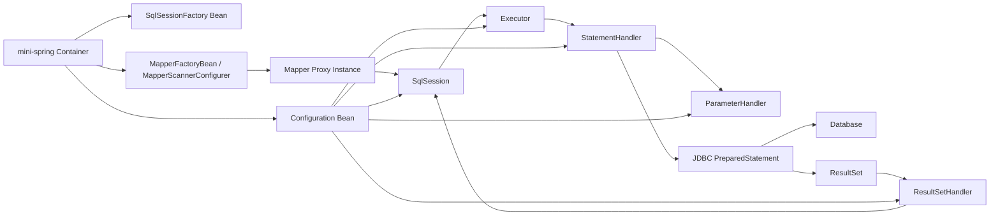
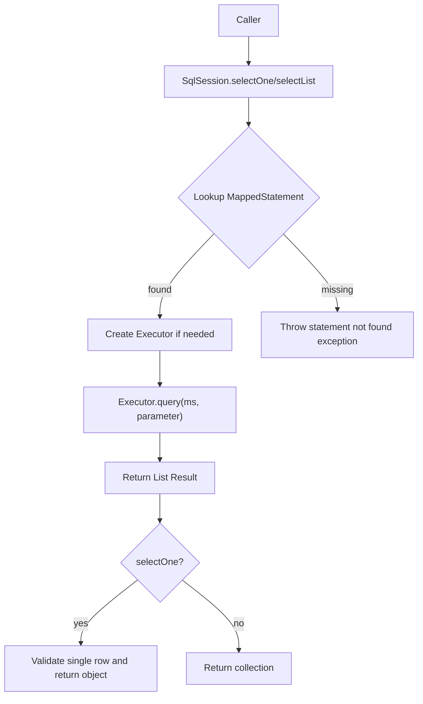
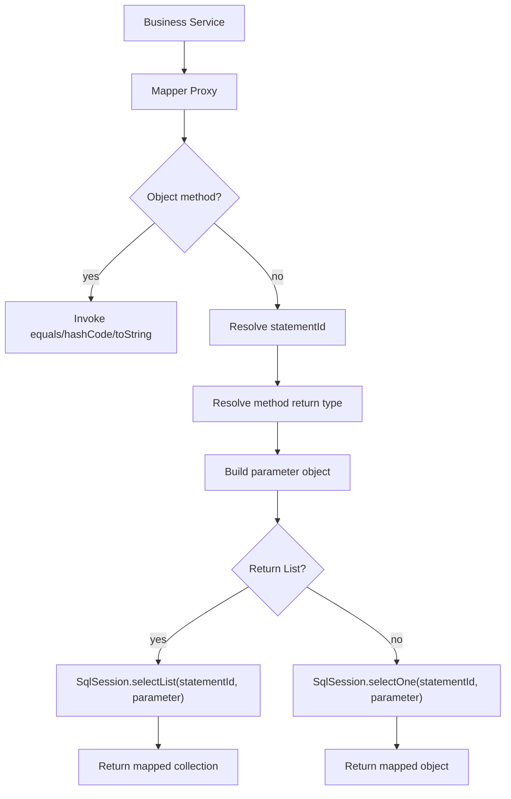
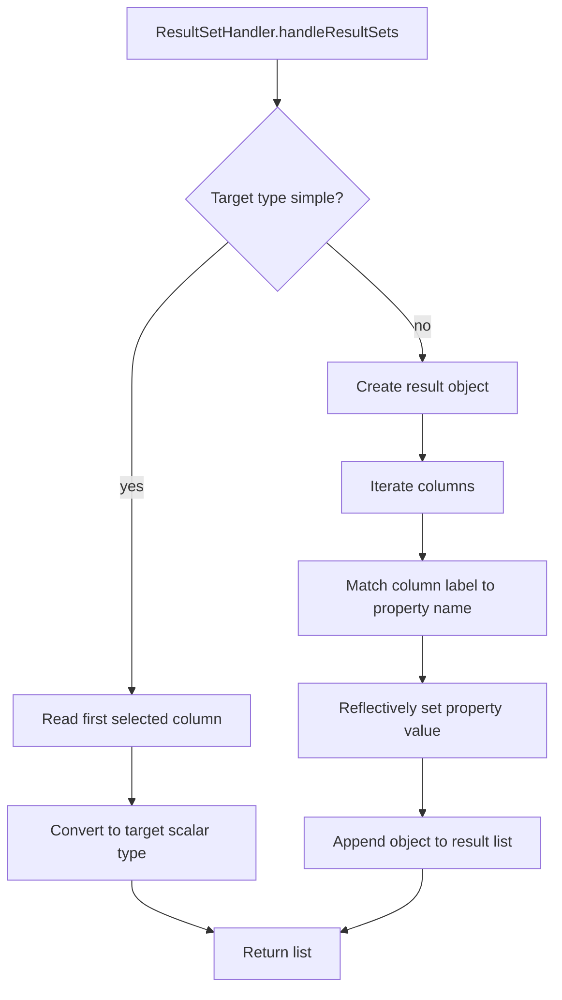

# 1. 背景与目标

## 为什么要做 mini-mybatis
- 目标是从 MyBatis 核心能力中抽取最小可用闭环，沉淀一个可运行、可扩展、可集成 mini-spring 的轻量 ORM 框架。
- 设计重点不是覆盖 MyBatis 全量特性，而是明确持久层执行链的关键抽象：`SqlSession -> MapperProxy -> Executor -> StatementHandler / ParameterHandler / ResultSetHandler -> JDBC`。
- 该框架用于承载后续能力迭代，包括参数绑定增强、结果映射增强、执行器扩展与事务对接。

## 与 JDBC 的区别
- JDBC 提供原始数据库访问能力，调用方直接管理 SQL、参数设置、结果集解析与资源释放。
- mini-mybatis 在 JDBC 之上增加统一配置模型、Mapper 接口代理、SQL 映射解析、参数绑定策略、结果映射策略与执行职责拆分。
- JDBC 面向调用细节；mini-mybatis 面向框架级执行链与统一扩展点。

## 与 mini-spring 的关系
- mini-mybatis 不自行构建容器，所有核心组件统一由 mini-spring 托管为 Bean。
- `Configuration`、`SqlSessionFactory`、`SqlSessionTemplate`、`MapperFactoryBean`、`MapperScannerConfigurer` 需要具备 Bean 化能力。
- mini-spring 负责生命周期、依赖注入、配置装配；mini-mybatis 负责 SQL 执行链、映射模型与 JDBC 访问抽象。

## 术语表
| 术语 | 定义 |
| --- | --- |
| `Configuration` | 全局配置中心，统一持有数据源、映射语句、Mapper 注册信息、执行器类型与对象工厂等配置 |
| `SqlSessionFactory` | `SqlSession` 创建入口，基于 `Configuration` 构建会话 |
| `SqlSession` | 框架调用入口，向上提供 `selectOne`、`selectList`、`getMapper` 等能力 |
| `MapperProxy` | Mapper 接口动态代理，负责把接口方法调用转换为 `MappedStatement` 执行请求 |
| `MappedStatement` | 单条 SQL 映射定义，包含语句 id、SQL 来源、参数类型、结果类型、命令类型等元数据 |
| `Executor` | 执行核心，编排语句执行、连接使用与结果返回 |
| `StatementHandler` | 负责 `Statement` 创建、SQL 预编译与执行调用 |
| `ParameterHandler` | 负责将入参绑定到 JDBC 占位符 |
| `ResultSetHandler` | 负责将 `ResultSet` 转换为目标对象或对象集合 |
| `BoundSql` | 经过解析后的可执行 SQL 及参数映射信息 |
| `MapperRegistry` | Mapper 接口注册中心，负责维护接口与代理工厂映射 |

## com.xujn 包结构建议
```text
com.xujn.minimybatis
├── binding
│   ├── MapperProxy
│   ├── MapperMethod
│   ├── MapperProxyFactory
│   └── MapperRegistry
├── builder
│   ├── xml
│   │   ├── XmlConfigBuilder
│   │   ├── XmlMapperBuilder
│   │   └── XmlStatementParser
│   └── BaseBuilder
├── datasource
│   └── ConnectionFactory
├── executor
│   ├── Executor
│   ├── SimpleExecutor
│   ├── statement
│   │   ├── StatementHandler
│   │   ├── PreparedStatementHandler
│   │   └── RoutingStatementHandler
│   ├── parameter
│   │   ├── ParameterHandler
│   │   └── DefaultParameterHandler
│   └── resultset
│       ├── ResultSetHandler
│       └── DefaultResultSetHandler
├── mapping
│   ├── BoundSql
│   ├── MappedStatement
│   ├── ParameterMapping
│   ├── SqlCommandType
│   └── SqlSource
├── parsing
│   ├── GenericTokenParser
│   ├── ParameterExpression
│   └── SqlSourceBuilder
├── reflection
│   ├── MetaClass
│   ├── MetaObject
│   ├── Reflector
│   └── ObjectFactory
├── session
│   ├── Configuration
│   ├── SqlSession
│   ├── SqlSessionFactory
│   ├── SqlSessionFactoryBuilder
│   └── defaults
│       ├── DefaultSqlSession
│       └── DefaultSqlSessionFactory
├── support
│   ├── ErrorContext
│   ├── JdbcUtils
│   └── ExceptionFactory
└── spring
    ├── MapperFactoryBean
    ├── MapperScannerConfigurer
    ├── SqlSessionFactoryBean
    └── SqlSessionTemplate
```

# 2. MyBatis 核心能力抽取

## 能力清单

### 必须能力
| 能力 | 定义 | 价值 | 最小闭环 | 依赖关系 | 边界 | 可选增强 |
| --- | --- | --- | --- | --- | --- | --- |
| `Configuration` 全局配置中心 | 聚合所有运行期配置与映射元数据 | 保证执行链入口一致、配置源统一 | 能注册 `MappedStatement`、Mapper、DataSource、Executor 类型 | 依赖 XML 解析、Mapper 注册 | 不负责业务事务编排 | 支持环境隔离、插件链注册 |
| `SqlSession` 会话入口 | 对外暴露查询调用与 Mapper 获取能力 | 隔离调用方与底层执行细节 | 支持 `selectOne`、`selectList`、`getMapper` | 依赖 `Configuration`、`Executor` | Phase 1 不支持批量更新与游标 | 增加 `insert/update/delete`、批处理 |
| `MapperProxy` 动态代理 | 将接口方法路由为语句执行 | 消除手写 DAO 模板代码 | 根据 `namespace + method` 定位 `MappedStatement` | 依赖 `MapperRegistry`、`SqlSession` | 不支持默认方法增强逻辑 | 缓存 `MapperMethod`、支持注解映射 |
| `MappedStatement` 映射语句模型 | 定义 SQL 元数据与执行配置 | 形成统一执行单元 | 支持 `id/sqlSource/parameterType/resultType/sqlCommandType` | 依赖 SQL 解析器 | Phase 1 不支持复杂 `resultMap` | 增加 `resultMapId`、`fetchSize` |
| `Executor` 执行核心 | 编排连接、SQL 执行和结果返回 | 统一控制执行时序与扩展入口 | 实现基础查询执行 | 依赖 Statement/Parameter/ResultSet handler | Phase 1 不做缓存 | 扩展 `ReuseExecutor`、`BatchExecutor` |
| `StatementHandler` | 负责 `PreparedStatement` 生命周期 | 拆分 SQL 执行职责 | 支持预编译、执行查询、关闭语句 | 依赖 `BoundSql`、Connection | 不做 Statement 复用 | 路由不同 Statement 类型 |
| `ParameterHandler` | 负责参数名到占位符索引的绑定 | 统一参数绑定策略 | 支持单参数、Map 参数、Bean 参数 | 依赖参数映射列表 | 只支持 `#{}` | 支持类型处理器 |
| `ResultSetHandler` | 负责结果集到对象的映射 | 统一对象构造与字段填充 | 支持简单类型和 JavaBean 映射 | 依赖反射工具 | 不支持嵌套对象和集合映射 | 支持显式 `ResultMap` |
| XML 映射模型 | 基于 XML 定义 SQL 语句 | 配置集中、便于解析 | 支持 `<mapper namespace>` 与 `<select>` | 依赖 XML Builder | Phase 1 只支持查询语句 | 增加 `<insert/update/delete>` |
| JDBC 执行抽象 | 基于 `DataSource` 获取连接与执行 JDBC | 保持实现边界清晰 | 支持连接获取、参数设置、结果读取、资源关闭 | 依赖 DataSource | 不设计连接池 | 接入事务同步管理 |

### 可选能力
| 能力 | 定义 | 价值 | 最小闭环 | 依赖关系 | 边界 | 可选增强 |
| --- | --- | --- | --- | --- | --- | --- |
| 注解映射模型 | 通过注解定义 SQL | 降低 XML 依赖 | 需要解析注解到 `MappedStatement` | 依赖 Mapper 扫描 | 当前默认不启用 | 同时支持 XML 与注解优先级 |
| 显式 `ResultMap` | 字段到属性手工映射 | 解决字段名与属性名不一致 | 需定义结果映射元数据 | 依赖 `ResultSetHandler` 扩展 | Phase 1 不做 | 嵌套映射 |
| 执行器扩展点 | 允许不同执行策略 | 为缓存、批处理、复用预留 | 抽象 `Executor` 接口 | 依赖统一执行上下文 | 暂不提供插件链 | 责任链或装饰器扩展 |
| 事务同步集成 | 与 mini-spring 事务生命周期联动 | 保证事务内连接一致 | 需接入容器事务上下文 | 依赖 mini-spring 事务模块 | 本阶段只说明接口边界 | 集成事务同步管理器 |

### 不做能力
| 能力 | 定义 | 价值 | 最小闭环 | 依赖关系 | 边界 | 可选增强 |
| --- | --- | --- | --- | --- | --- | --- |
| 二级缓存 | 跨 Session 共享缓存 | 提升重复查询性能 | 当前不纳入闭环 | 依赖缓存命名空间 | 明确不支持 | Phase 4 之后再评估 |
| 插件体系 | 对执行节点进行拦截增强 | 提供横切扩展能力 | 只预留接口位 | 依赖统一责任链模型 | Phase 1 不实现 | 增加拦截器与代理包装 |
| 完整动态 SQL | `if/foreach/choose` 等复杂 SQL 组装 | 提高表达能力 | 当前不纳入闭环 | 依赖脚本解析器 | Phase 3 可评估有限支持 | 构建 SQL 节点树 |
| 数据库方言适配 | 针对不同数据库生成差异 SQL | 提升跨数据库兼容性 | 当前不纳入闭环 | 依赖方言抽象 | 不支持 | 后续按数据库补充 |

## 概念映射
| mini-mybatis 概念 | MyBatis 核心类名 |
| --- | --- |
| 全局配置 | `org.apache.ibatis.session.Configuration` |
| 会话工厂 | `org.apache.ibatis.session.SqlSessionFactory` |
| 默认会话 | `org.apache.ibatis.session.defaults.DefaultSqlSession` |
| 映射语句 | `org.apache.ibatis.mapping.MappedStatement` |
| 执行器 | `org.apache.ibatis.executor.Executor` |
| 语句处理器 | `org.apache.ibatis.executor.statement.StatementHandler` |
| 参数处理器 | `org.apache.ibatis.executor.parameter.ParameterHandler` |
| 结果集处理器 | `org.apache.ibatis.executor.resultset.ResultSetHandler` |
| Mapper 代理 | `org.apache.ibatis.binding.MapperProxy` |
| Mapper 注册中心 | `org.apache.ibatis.binding.MapperRegistry` |

# 3. mini-mybatis 架构设计总览

## 设计原则
- 职责拆分：会话入口、代理层、执行核心、参数绑定、结果映射分别承担单一职责。
- 执行链：所有查询统一走 `SqlSession -> Executor -> StatementHandler -> ParameterHandler -> ResultSetHandler`。
- 可扩展：扩展点统一以接口放在链路节点，配置统一进入 `Configuration`。
- 容器友好：核心对象可独立构造，也可通过 mini-spring Bean 生命周期管理。
- 最小闭环优先：Phase 1 只保证基础查询可运行，不提前引入缓存、插件、复杂动态 SQL。

## 总体架构图
**标题：mini-mybatis 总体架构图**  
**覆盖范围说明：展示 mini-spring 容器、Mapper 代理层、执行链与 JDBC 之间的关系。**



## 模块拆分与职责说明
| 模块 | 目的 | 最小实现要点 | 边界 | 可选增强 | 依赖关系 |
| --- | --- | --- | --- | --- | --- |
| `session` | 统一入口与生命周期编排 | 提供 `SqlSessionFactory`、`SqlSession` 与默认实现 | 不负责 XML 细节解析 | 支持线程绑定模板会话 | 依赖 `Configuration`、`Executor` |
| `binding` | Mapper 接口代理与路由 | 维护接口到 `MapperProxyFactory` 的注册表 | 不直接操作 JDBC | 支持方法缓存 | 依赖 `session`、`mapping` |
| `mapping` | SQL 元数据模型 | 定义 `MappedStatement`、`BoundSql`、参数映射 | 不负责 XML 读取 | 增加结果映射模型 | 依赖 `parsing` |
| `executor` | 执行与职责链编排 | 调用 handler 执行查询并处理资源释放 | 不负责容器事务开始/提交 | 扩展执行器种类 | 依赖 JDBC 与 `mapping` |
| `builder` | XML 配置与 Mapper 解析 | 读取 XML 并装配到 `Configuration` | 不执行 SQL | 增加注解 builder | 依赖 `mapping`、`session` |
| `reflection` | 对象创建与属性访问 | 实现 JavaBean 属性写入与对象构造 | 不负责 SQL 逻辑 | 支持别名、类型转换 | 依赖 JDK 反射 |
| `spring` | 与 mini-spring 集成 | 提供工厂 Bean、扫描器与模板会话 | 不替代容器核心能力 | 对接事务同步 | 依赖 mini-spring SPI |

## 与 mini-spring 集成方式
> [注释] mini-mybatis 必须作为 mini-spring 的持久层组件集成，而不是独立运行时容器
> - 背景：项目约束要求 `Mapper`、`SqlSessionFactory`、`Configuration` 等核心对象统一交由 mini-spring 托管。
> - 影响：mini-mybatis 需要暴露 `FactoryBean`、扫描器与模板会话，避免业务层直接管理 SQL 会话创建。
> - 取舍：Phase 1 只要求完成 Bean 注册与依赖装配，不引入复杂事务传播与 AOP 增强。
> - 可选增强：后续可对接 mini-spring 的事务同步器，实现线程内连接复用与声明式事务支持。

- `SqlSessionFactoryBean`
  - 目的：将 `DataSource`、`mapperLocations`、基础配置装配成 `SqlSessionFactory` Bean。
  - 最小实现要点：初始化时解析 XML，构建 `Configuration`，再生成默认工厂。
  - 边界：不负责自动扫描 Mapper 接口。
  - 可选增强：支持别名包、插件列表、事务工厂。
  - 依赖关系：依赖 mini-spring Bean 生命周期、`XmlMapperBuilder`。
- `MapperScannerConfigurer`
  - 目的：扫描指定包下的 Mapper 接口并注册 `MapperFactoryBean`。
  - 最小实现要点：识别接口类型，按 BeanDefinition 注册工厂 Bean。
  - 边界：只处理接口，不处理普通类。
  - 可选增强：支持注解过滤、命名规则定制。
  - 依赖关系：依赖 mini-spring 扫描扩展点、`MapperRegistry`。
- `MapperFactoryBean<T>`
  - 目的：为每个 Mapper 接口生成代理对象 Bean。
  - 最小实现要点：从 `SqlSessionFactory` 获取 `SqlSessionTemplate`，再创建代理。
  - 边界：不持有数据库连接。
  - 可选增强：支持延迟初始化。
  - 依赖关系：依赖 `SqlSessionTemplate`、`MapperProxyFactory`。
- `SqlSessionTemplate`
  - 目的：作为容器管理下的线程安全会话门面。
  - 最小实现要点：每次调用时从工厂获取会话，执行完成后关闭；未来可接事务同步。
  - 边界：Phase 1 默认无事务上下文复用。
  - 可选增强：与事务上下文绑定单连接。
  - 依赖关系：依赖 `SqlSessionFactory`。

# 4. 核心数据结构与接口草图

## Configuration
- 目的：统一保存运行时所需全部配置，确保执行链读取单一配置源。
- 最小实现要点：
  - 持有 `DataSource`
  - 持有 `Map<String, MappedStatement>`
  - 持有 `MapperRegistry`
  - 持有执行器类型或执行器工厂
  - 持有对象工厂、反射器工厂、环境标识
- 边界：
  - 支持查询场景基础配置
  - 不支持多环境切换策略
- 可选增强：
  - 类型处理器注册表
  - 插件链
  - 别名注册表
- 依赖关系：依赖 `mapping`、`binding`、`datasource`

```java
public class Configuration {
    private DataSource dataSource;
    private Map<String, MappedStatement> mappedStatements;
    private MapperRegistry mapperRegistry;
    private ExecutorType defaultExecutorType;
    private ObjectFactory objectFactory;
    private boolean mapUnderscoreToCamelCase;
    private String environmentId;
}
```

## MappedStatement
- 目的：将单条 SQL 抽象为可执行元数据单元。
- 最小实现要点：
  - 语句唯一 id
  - 所属 namespace
  - `SqlSource`
  - SQL 命令类型
  - 参数类型
  - 结果类型
  - 可选结果映射 id
- 边界：
  - 支持单语句单结果类型配置
  - 不支持嵌套结果映射
- 可选增强：
  - `fetchSize`
  - `timeout`
  - `statementType`
- 依赖关系：依赖 `SqlSource`、`SqlCommandType`

```java
public class MappedStatement {
    private String id;
    private String namespace;
    private SqlSource sqlSource;
    private SqlCommandType sqlCommandType;
    private Class<?> parameterType;
    private Class<?> resultType;
    private String resultMapId;
}
```

## SqlSession 接口草图
- 目的：为上层提供统一数据库访问入口。
- 最小实现要点：支持单条查询、列表查询、Mapper 获取、关闭。
- 边界：Phase 1 不暴露事务控制接口。
- 可选增强：支持增删改、批处理、手动提交。
- 依赖关系：依赖 `Configuration`、`Executor`

```java
public interface SqlSession extends AutoCloseable {
    <T> T selectOne(String statement);
    <T> T selectOne(String statement, Object parameter);
    <E> List<E> selectList(String statement);
    <E> List<E> selectList(String statement, Object parameter);
    <T> T getMapper(Class<T> type);
    Configuration getConfiguration();
    @Override
    void close();
}
```

## Executor 接口草图
- 目的：屏蔽底层语句执行细节，统一编排执行链。
- 最小实现要点：支持查询与关闭。
- 边界：不负责 Mapper 路由。
- 可选增强：支持缓存包装执行器。
- 依赖关系：依赖 `StatementHandler`、`Configuration`

```java
public interface Executor {
    <E> List<E> query(MappedStatement ms, Object parameter);
    void close(boolean forceRollback);
}
```

## StatementHandler / ParameterHandler / ResultSetHandler 接口草图
- 目的：将 SQL 执行拆分为可替换节点。
- 最小实现要点：分离语句创建、参数绑定、结果解析。
- 边界：Phase 1 仅使用 `PreparedStatement`。
- 可选增强：支持多 Statement 类型路由。
- 依赖关系：依赖 JDBC、`BoundSql`、反射工具

```java
public interface StatementHandler {
    PreparedStatement prepare(Connection connection);
    void parameterize(PreparedStatement statement);
    <E> List<E> query(PreparedStatement statement);
    BoundSql getBoundSql();
}

public interface ParameterHandler {
    Object getParameterObject();
    void setParameters(PreparedStatement statement);
}

public interface ResultSetHandler {
    <E> List<E> handleResultSets(PreparedStatement statement);
}
```

## MapperProxy 结构设计
- 目的：对 Mapper 接口调用进行统一拦截，并把方法映射到 `MappedStatement`。
- 最小实现要点：
  - 识别 `Object` 基础方法
  - 基于 `mapperInterface.getName() + "." + method.getName()` 生成 statementId
  - 将方法入参转换为执行器可识别的参数对象
  - 基于方法返回值类型决定调用 `selectOne` 或 `selectList`
- 边界：
  - Phase 1 不支持重载方法对应相同 statementId
  - 不支持接口默认方法增强
- 可选增强：
  - `MapperMethod` 缓存
  - 注解 SQL 路由
- 依赖关系：依赖 `SqlSession`、`Configuration`

> [注释] MapperProxy 负责把面向接口的方法调用转成面向映射语句的执行请求
> - 背景：上层依赖 Mapper 接口，不直接感知 SQL id、JDBC 或执行器实现。
> - 影响：Mapper 方法签名必须与 `MappedStatement` 元数据保持一一对应，否则运行期会出现语句缺失或参数不匹配。
> - 取舍：Phase 1 采用 `namespace + methodName` 的直接映射，避免引入复杂方法解析缓存。
> - 可选增强：引入 `MapperMethod` 解析器，缓存返回类型、参数解析策略与命令类型。

# 5. 核心执行流程

## 图 1：SqlSession 执行流程图
**标题：SqlSession 查询入口流程**  
**覆盖范围说明：展示从业务层通过 `SqlSession` 发起查询直到结果返回的最小闭环。**



## 图 2：MapperProxy 调用链流程图
**标题：MapperProxy 动态代理调用链**  
**覆盖范围说明：展示 Mapper 接口方法如何被代理并路由到 `SqlSession`。**



> [注释] MapperProxy 的动态代理调用流程决定了 Mapper 接口签名约束
> - 背景：Mapper 本身没有实现类，所有方法调用都依赖 JDK 动态代理分派到统一入口。
> - 影响：方法名、namespace、返回值类型与参数结构共同决定最终执行路径和结果装配方式。
> - 取舍：最小实现只支持按方法名定位 statementId，不支持重载方法与复杂签名区分。
> - 可选增强：增加基于方法签名缓存的命令解析器，并支持注解 SQL 与 XML 双来源选择。

## 图 3：SQL 执行职责链
**标题：Executor 到 JDBC 的 SQL 执行职责链**  
**覆盖范围说明：展示执行器、语句处理器、参数处理器与 JDBC 的职责边界。**


> [注释] SQL 映射与参数绑定策略以 `#{}` 占位符和 `PreparedStatement` 为中心
> - 背景：最小闭环需要同时解决 SQL 文本解析、参数名定位与 JDBC 类型设置问题。
> - 影响：SQL 必须先从 XML 解析为 `SqlSource`，再生成 `BoundSql` 和参数映射列表，最终由 `ParameterHandler` 按顺序绑定。
> - 取舍：Phase 1 只支持 `#{}` 占位符，不支持 `${}` 文本直拼，从源头降低 SQL 注入风险。
> - 可选增强：增加类型处理器注册表、复杂属性路径解析与注解参数名解析。

> [注释] SQL 注入风险控制依赖参数占位符策略，而不是调用方自律
> - 背景：字符串拼接式 SQL 会把不可信输入直接写入语句文本，无法由 JDBC 预编译保护。
> - 影响：框架必须默认以 `PreparedStatement` 与 `#{}` 为唯一正式参数绑定方式，禁止 Phase 1 提供 `${}`。
> - 取舍：牺牲部分动态 SQL 表达能力，换取更清晰的安全边界与更稳定的参数绑定模型。
> - 可选增强：后续若支持 `${}`，只能限定在白名单场景，例如排序字段枚举映射后替换。

## 图 4：结果集映射流程图
**标题：ResultSet 到对象的映射流程**  
**覆盖范围说明：展示 `ResultSetHandler` 如何把 JDBC 结果映射为简单对象或 JavaBean。**



> [注释] ResultMap 与对象映射策略在最小闭环内采用“简单匹配优先”
> - 背景：结果映射是 ORM 可用性的关键，但完整嵌套映射会显著放大实现复杂度。
> - 影响：Phase 1 默认采用列名与属性名直接匹配，可选支持下划线转驼峰；字段不一致时需要后续显式 `ResultMap` 扩展。
> - 取舍：优先保证简单对象映射稳定，不处理关联对象、集合属性与分步查询。
> - 可选增强：增加显式 `ResultMap`、构造器映射与嵌套对象映射。

## 执行链说明
- `SqlSession` 只负责入口语义与异常边界，不直接处理 JDBC 细节。
- `Executor` 统一组织连接获取、handler 创建、执行、异常转换与资源释放。
- `StatementHandler` 负责把 `MappedStatement + parameter` 组合为真正可执行的 JDBC 语句。
- `ParameterHandler` 负责占位符绑定顺序与参数值提取。
- `ResultSetHandler` 负责对象构造、属性写入与返回值封装。

> [注释] 多参数处理方式必须在代理层和参数绑定层保持同一模型
> - 背景：Mapper 方法可能出现多个离散参数，而 JDBC 绑定依赖严格的占位符顺序。
> - 影响：框架需要在 `MapperProxy` 中把多个参数归一化为 `Map<String, Object>` 或参数包装对象，再由 `ParameterHandler` 基于参数映射读取。
> - 取舍：Phase 1 推荐使用 `Map<String, Object>` 统一封装多参数，不提前引入注解参数名解析器。
> - 可选增强：支持 `@Param` 风格命名、方法参数元数据缓存与嵌套属性访问。

> [注释] Executor 扩展策略应保持“入口不变、节点可替换”
> - 背景：后续缓存、批处理或语句复用都需要改变执行策略，但不应改变 `SqlSession` 与 Mapper 层调用方式。
> - 影响：`Executor` 必须先抽象为稳定接口，默认实现使用 `SimpleExecutor`，后续能力以并列实现或装饰器扩展。
> - 取舍：Phase 1 只提供单一简单执行器，避免为未来特性引入空转复杂度。
> - 可选增强：增加 `CachingExecutor`、`ReuseExecutor`、`BatchExecutor` 以及执行统计包装器。

# 6. 关键设计取舍与边界

## 参数绑定方式（`#{}` 占位符策略）
- 目的：确保参数绑定统一、可预编译、可防注入。
- 最小实现要点：
  - XML 中的 `#{property}` 解析为 `?`
  - 生成按顺序排列的 `ParameterMapping`
  - `ParameterHandler` 按顺序调用 `PreparedStatement#setObject`
- 边界：
  - 支持单参数、Map 参数、JavaBean 参数
  - 不支持 `${}` 字符串替换
- 可选增强：
  - 类型处理器
  - 嵌套属性路径
- 依赖关系：依赖 `SqlSourceBuilder`、`ParameterHandler`

## SQL 来源（XML，默认）
- 目的：统一 SQL 配置来源并降低代理层复杂度。
- 最小实现要点：
  - 支持 `<mapper namespace="...">`
  - 支持 `<select id="" parameterType="" resultType="">`
  - 构建 `MappedStatement` 注册入 `Configuration`
- 边界：
  - Phase 1 只支持 XML
  - 不支持注解与 XML 混用优先级处理
- 可选增强：
  - 注解 SQL
  - 外部 SQL 片段复用
- 依赖关系：依赖 XML Builder、`MappedStatement`

## 多参数处理策略
- 目的：在 Mapper 接口签名与 JDBC 参数绑定之间建立稳定映射。
- 最小实现要点：
  - 单参数直接传递
  - 多参数统一包装为 `Map<String, Object>`
  - 默认键名支持 `param1`、`param2` 与真实参数名占位兼容
- 边界：
  - 不支持复杂注解参数命名
  - 不支持可变参数特殊展开
- 可选增强：
  - `@Param`
  - 参数名缓存
- 依赖关系：依赖 `MapperProxy`、`ParameterHandler`

## 结果映射策略（字段名匹配 vs 显式映射）
- 目的：在最小复杂度下完成对象装配。
- 最小实现要点：
  - `resultType` 指定目标类型
  - 简单类型取首列
  - JavaBean 使用列标签匹配属性名
- 边界：
  - 默认 `SIMPLE`
  - 不支持嵌套对象、集合属性、判别器
- 可选增强：
  - 显式 `ResultMap`
  - 下划线转驼峰
- 依赖关系：依赖 `ResultSetHandler`、反射工具

## 事务与连接管理策略（最小支持）
- 目的：明确连接生命周期与事务边界责任归属。
- 最小实现要点：
  - 默认每次 `SqlSession` 调用独立获取连接
  - 查询执行后关闭 `ResultSet`、`Statement`、`Connection`
  - 预留与 mini-spring 事务同步的连接获取接口
- 边界：
  - Phase 1 不实现声明式事务
  - 不实现复杂传播行为
- 可选增强：
  - 事务上下文内复用连接
  - 提交回滚策略扩展
- 依赖关系：依赖 `DataSource`、未来 mini-spring 事务模块

> [注释] 与事务/连接生命周期关系必须由容器边界和执行边界共同定义
> - 背景：连接管理既影响资源释放，又直接决定事务一致性。
> - 影响：如果没有事务上下文，执行器应在单次调用后主动关闭连接；如果未来接入 mini-spring 事务，同线程内连接必须复用且延后关闭。
> - 取舍：当前版本优先保证资源释放正确，不提前实现复杂事务传播模型。
> - 可选增强：通过事务同步管理器绑定连接、支持提交与回滚钩子。

## 是否支持缓存
- 目的：明确 Phase 1 功能边界，避免执行链设计被缓存逻辑干扰。
- 最小实现要点：
  - Phase 1 不实现一级缓存和二级缓存
  - `Executor` 接口保留后续包装可能
- 边界：
  - 所有查询直达数据库
  - 不做命名空间缓存失效控制
- 可选增强：
  - `CachingExecutor`
  - 本地会话级缓存
- 依赖关系：依赖稳定的 `Executor` 抽象

# 7. 开发迭代计划（Git 驱动）

## Phase 1：SqlSession + MapperProxy + MappedStatement + 基础查询闭环
- 目标：打通 XML 映射、Mapper 代理、查询执行和简单结果返回的最小闭环。
- 范围：
  - `Configuration`
  - `MappedStatement`
  - `SqlSessionFactory` / `DefaultSqlSession`
  - `MapperProxy`
  - `SimpleExecutor`
  - XML `<select>` 解析
- 交付物：
  - 核心会话与映射模型
  - XML Builder
  - 查询示例链路
  - mini-spring Bean 集成骨架
- 验收标准（可量化）：
  - 能通过 Mapper 接口执行 1 条简单查询并返回单对象
  - 能通过 `SqlSession.selectList` 返回对象集合
  - 缺失 `MappedStatement` 时抛出明确异常
  - 每次执行后连接、语句、结果集均关闭
- 风险与缓解：
  - 风险：XML 解析与 Mapper namespace 不一致
  - 缓解：初始化阶段校验 statementId 唯一性与 namespace 合法性

## Phase 2：参数绑定与结果映射增强
- 目标：增强参数绑定模型与简单对象映射能力，提升可用性。
- 范围：
  - `ParameterHandler`
  - `ResultSetHandler`
  - 多参数封装
  - 下划线转驼峰配置
  - 简单类型与 JavaBean 双模式映射
- 交付物：
  - `BoundSql`
  - `ParameterMapping`
  - 默认参数与结果处理器
  - 失败路径测试用例
- 验收标准（可量化）：
  - 支持单参数、Bean 参数、多参数三种绑定模式
  - 简单类型查询映射成功率 100%
  - JavaBean 映射覆盖属性名一致场景
  - 参数数量不匹配时抛出框架异常
- 风险与缓解：
  - 风险：列名与属性名不一致导致结果为空字段
  - 缓解：先支持可配置下划线转驼峰，Phase 3 再引入显式 `ResultMap`

## Phase 3：动态 SQL 或执行器扩展能力
- 目标：在不破坏入口模型的前提下增加执行能力扩展。
- 范围：
  - 有限动态 SQL 或执行器扩展二选一优先落地
  - `ReuseExecutor` 或 `CachingExecutor` 原型
  - XML 脚本节点最小支持
- 交付物：
  - 扩展执行器接口实现
  - 扩展设计文档
  - 回归测试
- 验收标准（可量化）：
  - 保持已有 Mapper 接口与 `SqlSession` API 不变
  - 新增扩展点后 Phase 1/2 用例全部通过
  - 扩展实现不修改 `MappedStatement` 基础模型
- 风险与缓解：
  - 风险：过早引入复杂动态 SQL 拉高解析复杂度
  - 缓解：优先实现执行器扩展，动态 SQL 只做有限节点支持

# 8. Git 规范

## commit message 格式
- 格式：`type(scope): subject`
- 约束：
  - `type` 使用 Angular Conventional Commits
  - `scope` 对应模块或阶段，例如 `session`、`binding`、`executor`、`spring`
  - `subject` 使用英文动词短语，描述单一变更意图

## type 列表
- `feat`：新增功能
- `fix`：缺陷修复
- `refactor`：重构，不改变外部行为
- `docs`：文档变更
- `test`：测试补充或调整
- `chore`：构建、脚本、配置类变更

## 每个 phase 至少 3 条示例提交

### Phase 1 示例提交
1. `feat(session): add configuration and default sql session factory`  
   文件路径：`/Users/xjn/Develop/projects/java/mini-mybatis/src/main/java/com/xujn/minimybatis/session/Configuration.java`  
   文件路径：`/Users/xjn/Develop/projects/java/mini-mybatis/src/main/java/com/xujn/minimybatis/session/defaults/DefaultSqlSessionFactory.java`
2. `feat(binding): add mapper registry and proxy factory`  
   文件路径：`/Users/xjn/Develop/projects/java/mini-mybatis/src/main/java/com/xujn/minimybatis/binding/MapperRegistry.java`  
   文件路径：`/Users/xjn/Develop/projects/java/mini-mybatis/src/main/java/com/xujn/minimybatis/binding/MapperProxyFactory.java`
3. `feat(builder): parse xml select statements into mapped statements`  
   文件路径：`/Users/xjn/Develop/projects/java/mini-mybatis/src/main/java/com/xujn/minimybatis/builder/xml/XmlMapperBuilder.java`  
   文件路径：`/Users/xjn/Develop/projects/java/mini-mybatis/src/main/resources/mapper/*.xml`

### Phase 2 示例提交
1. `feat(parameter): add default parameter handler for placeholder binding`  
   文件路径：`/Users/xjn/Develop/projects/java/mini-mybatis/src/main/java/com/xujn/minimybatis/executor/parameter/DefaultParameterHandler.java`  
   文件路径：`/Users/xjn/Develop/projects/java/mini-mybatis/src/main/java/com/xujn/minimybatis/mapping/ParameterMapping.java`
2. `feat(resultset): map simple bean properties from result set columns`  
   文件路径：`/Users/xjn/Develop/projects/java/mini-mybatis/src/main/java/com/xujn/minimybatis/executor/resultset/DefaultResultSetHandler.java`  
   文件路径：`/Users/xjn/Develop/projects/java/mini-mybatis/src/main/java/com/xujn/minimybatis/reflection/MetaObject.java`
3. `test(executor): cover parameter mismatch and mapping failure cases`  
   文件路径：`/Users/xjn/Develop/projects/java/mini-mybatis/src/test/java/com/xujn/minimybatis/executor/ExecutorTest.java`  
   文件路径：`/Users/xjn/Develop/projects/java/mini-mybatis/src/test/resources/mapper/error-case-mapper.xml`

### Phase 3 示例提交
1. `feat(executor): introduce reusable executor extension point`  
   文件路径：`/Users/xjn/Develop/projects/java/mini-mybatis/src/main/java/com/xujn/minimybatis/executor/ReuseExecutor.java`  
   文件路径：`/Users/xjn/Develop/projects/java/mini-mybatis/src/main/java/com/xujn/minimybatis/executor/Executor.java`
2. `refactor(statement): route prepared statement handling by statement type`  
   文件路径：`/Users/xjn/Develop/projects/java/mini-mybatis/src/main/java/com/xujn/minimybatis/executor/statement/RoutingStatementHandler.java`  
   文件路径：`/Users/xjn/Develop/projects/java/mini-mybatis/src/main/java/com/xujn/minimybatis/executor/statement/PreparedStatementHandler.java`
3. `docs(architecture): add phase 3 extension design and acceptance notes`  
   文件路径：`/Users/xjn/Develop/projects/java/mini-mybatis/docs/mybatis-phase-3.md`  
   文件路径：`/Users/xjn/Develop/projects/java/mini-mybatis/tests/acceptance-mybatis-phase-3.md`

## 分支策略
- 主分支：`main`
- 功能分支：`codex/phase-1-core-query`、`codex/phase-2-binding-mapping`、`codex/phase-3-executor-extension`
- 约束：
  - 每个 Phase 单独分支开发
  - 禁止在同一分支跨 Phase 混合提交
  - 合并前要求文档、测试与实现保持同批次提交可追踪

## PR 模板要点
- 变更目标：说明所属 Phase 与交付范围
- 核心设计：列出变更涉及的执行链节点
- 影响面：说明是否影响 Mapper 映射、参数绑定或结果映射
- 验收证据：列出通过的验收用例与失败路径覆盖
- 回滚策略：说明回滚后是否影响 XML 配置兼容性
