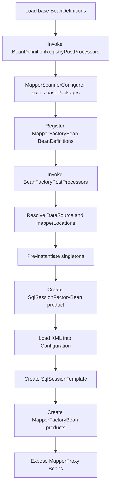
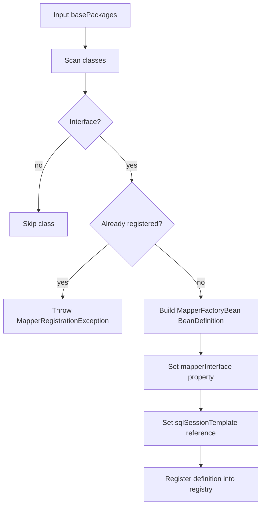
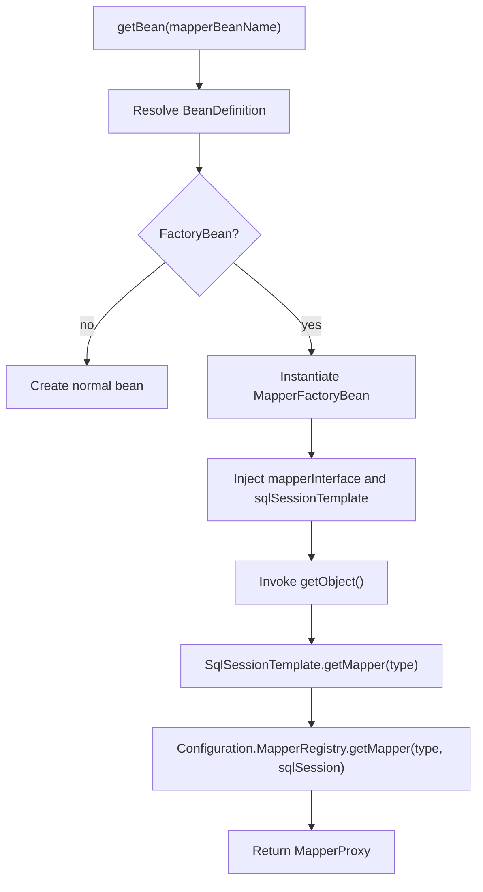

# Integration Phase 1: Mapper Bean Bootstrap

## 1. 目标与范围（必须/不做）

### 目标
- 在 mini-spring `refresh` 启动阶段完成 Mapper 接口扫描、`BeanDefinition` 注册与 `FactoryBean` 装配。
- 由容器托管 `SqlSessionFactoryBean`，完成 `Configuration` 初始化、XML 映射加载与 `MapperRegistry` 注册。
- 让业务层通过 `getBean(mapper)` 获取 Mapper 代理 Bean，并打通 mini-mybatis 基础查询闭环。

### 必须范围
- `MapperScannerConfigurer`
- `ClassPathMapperScanner`
- `MapperFactoryBean`
- `SqlSessionFactoryBean`
- `SqlSessionTemplate` 最小门面
- XML `mapperLocations` 加载
- `Configuration` 初始化与 `MapperRegistry` 注册
- `FAIL_FAST` 冲突策略

### 不做
- 连接池实现
- 完整事务管理
- XML 热加载
- JavaConfig 导入入口
- 插件链
- 注解 SQL 映射

## 2. 设计与关键决策

### 包结构（com.xujn）
```text
com.xujn.minispring.integration.mybatis
├── scanner
│   ├── MapperScanner
│   ├── ClassPathMapperScanner
│   └── MapperScannerConfigurer
├── factory
│   ├── MapperFactoryBean
│   └── SqlSessionFactoryBean
├── support
│   ├── SqlSessionTemplate
│   ├── MapperBeanNameGenerator
│   └── ResourcePatternResolver
└── exception
    ├── MapperRegistrationException
    ├── MappingLoadException
    ├── StatementConflictException
    └── MissingDataSourceException

com.xujn.minimybatis
├── binding
│   ├── MapperProxy
│   └── MapperRegistry
├── builder
│   └── xml
├── mapping
├── executor
└── session

com.xujn.minispring
├── beans
├── context
└── aop
```

- `integration.mybatis.scanner`
  - 目的：扫描 Mapper 接口并注册 `MapperFactoryBean` 的 `BeanDefinition`。
  - 最小实现要点：按包扫描；只接受接口；写入 `mapperInterface` 与 `sqlSessionTemplate` 依赖引用。
  - 边界：不创建代理实例；不加载 XML。
  - 可选增强：注解过滤、排除规则、BeanName 生成策略。
  - 依赖关系：`integration -> mini-spring registry`，`integration -> mini-mybatis binding metadata`
- `integration.mybatis.factory`
  - 目的：把容器创建流程桥接到 mybatis 运行时对象。
  - 最小实现要点：`MapperFactoryBean` 产出 Mapper 代理；`SqlSessionFactoryBean` 产出 `SqlSessionFactory`。
  - 边界：不管理事务提交；不负责 AOP。
  - 可选增强：延迟初始化、多工厂引用。
  - 依赖关系：`integration -> mini-spring FactoryBean`，`integration -> mini-mybatis session/configuration`
- `integration.mybatis.support`
  - 目的：提供模板门面与资源解析支持。
  - 最小实现要点：`SqlSessionTemplate` 统一获取和关闭 `SqlSession`；资源解析器定位 XML。
  - 边界：不改写 `BeanDefinition`。
  - 可选增强：事务同步、资源缓存。
  - 依赖关系：`integration -> mini-mybatis session`，`integration -> mini-spring resource abstraction`

### 核心组件接口草图（FactoryBean/Scanner/Template/FactoryBean）

#### MapperScanner
- 目的：统一扫描入口与候选类型判定。
- 最小实现要点：输入 `basePackages`，输出 `BeanDefinition` 集合。
- 边界：只负责扫描结果，不负责注册后的实例创建。
- 可选增强：支持 `ANNOTATION` 模式。
- 依赖关系：`integration -> mini-spring scanning`

```java
public interface MapperScanner {
    Set<BeanDefinition> scan(String... basePackages);
    boolean isCandidateComponent(Class<?> beanClass);
}
```

#### MapperFactoryBean
- 目的：通过 `FactoryBean` 语义将 Mapper 接口包装成容器产品对象。
- 最小实现要点：返回 Mapper 代理；声明单例产品；暴露接口类型。
- 边界：不向业务层暴露 `SqlSession`。
- 可选增强：懒加载、原型模式。
- 依赖关系：`integration -> mini-spring FactoryBean`，`integration -> mini-mybatis MapperRegistry`

```java
public class MapperFactoryBean<T> implements FactoryBean<T> {
    public void setMapperInterface(Class<T> mapperInterface);
    public void setSqlSessionTemplate(SqlSessionTemplate sqlSessionTemplate);
    public T getObject();
    public Class<?> getObjectType();
    public boolean isSingleton();
}
```

#### SqlSessionFactoryBean
- 目的：在容器预实例化阶段构建 `SqlSessionFactory` 与 `Configuration`。
- 最小实现要点：接收 `DataSource`、`mapperLocations`、冲突策略并完成 XML 注册。
- 边界：单数据源；XML 模式。
- 可选增强：类型别名、插件、事务工厂。
- 依赖关系：`integration -> mini-spring bean properties`，`integration -> mini-mybatis Configuration`

```java
public class SqlSessionFactoryBean implements FactoryBean<SqlSessionFactory> {
    private DataSource dataSource;
    private String configLocation;
    private String[] mapperLocations;
    private boolean failFast;
    private ConflictPolicy conflictPolicy;
}
```

#### SqlSessionTemplate
- 目的：为 `MapperFactoryBean` 和后续业务调用提供线程安全门面。
- 最小实现要点：封装 `selectOne`、`selectList`、`getMapper`。
- 边界：Phase 1 不实现事务绑定。
- 可选增强：更新语句、事务同步。
- 依赖关系：`integration -> mini-mybatis SqlSessionFactory`

```java
public interface SqlSessionTemplate {
    <T> T selectOne(String statement, Object parameter);
    <E> List<E> selectList(String statement, Object parameter);
    <T> T getMapper(Class<T> mapperType);
}
```

### 生命周期对齐点（refresh 阶段）
> [注释] Mapper 扫描与 BeanDefinition 注册必须发生在 refresh 的注册后处理阶段
> - 背景：Mapper 是接口，容器默认实例化路径无法直接处理。
> - 影响：只有先把 Mapper 转成 `MapperFactoryBean` 定义，后续单例预实例化才能正确进入工厂分支。
> - 取舍：扫描注册放在 `BeanDefinitionRegistryPostProcessor`，不在 `createBean` 中增加接口专用逻辑。
> - 可选增强：后续通过 JavaConfig 的 registrar 提前注入同一注册逻辑。

> [注释] 生命周期顺序必须保证 SqlSessionFactory 早于 MapperFactoryBean 产品对象创建
> - 背景：Mapper 代理创建依赖 `SqlSessionTemplate`，模板依赖 `SqlSessionFactory`。
> - 影响：如果 `SqlSessionFactoryBean` 没有先完成产品对象创建，Mapper 代理会因为依赖缺失而失败。
> - 取舍：通过 Bean 依赖引用和预实例化顺序保证 `SqlSessionFactoryBean -> SqlSessionTemplate -> MapperFactoryBean`。
> - 可选增强：增加基础设施依赖顺序校验器。

- refresh 对齐顺序
  1. 加载基础 BeanDefinition。
  2. 执行 `BeanDefinitionRegistryPostProcessor`。
  3. `MapperScannerConfigurer` 按包扫描并注册 `MapperFactoryBean` 定义。
  4. 执行 `BeanFactoryPostProcessor`，解析 `mapperLocations` 与 `DataSource` 依赖。
  5. 注册 `BeanPostProcessor` 与 AOP 相关增强器。
  6. 预实例化单例。
  7. 创建 `SqlSessionFactoryBean` 产品对象，完成 XML 加载与 `Configuration` 初始化。
  8. 创建 `SqlSessionTemplate`。
  9. 创建 `MapperFactoryBean` 产品对象，返回 Mapper 代理。

### 冲突/错误策略（必要处注释说明块）
> [注释] Phase 1 默认使用 FAIL_FAST，重复 mapper、重复 statementId、资源缺失都在启动期终止
> - 背景：集成阶段的错误属于配置错误，不应推迟到运行期首个查询时暴露。
> - 影响：`SqlSessionFactoryBean` 初始化必须完整解析 XML，并执行全量冲突检查。
> - 取舍：不提供静默覆盖；`OVERRIDE` 不在 Phase 1 启用。
> - 可选增强：开发模式下输出冲突汇总报告。

- `MissingDataSourceException`
  - 目的：阻止在无 `DataSource` 条件下创建 `SqlSessionFactory`。
  - 最小实现要点：错误信息必须包含 `beanName` 与依赖引用名。
  - 边界：启动期抛出；不降级。
  - 可选增强：给出候选 `DataSource` Bean 列表。
  - 依赖关系：`integration -> mini-spring bean resolution`
- `MappingLoadException`
  - 目的：暴露 XML 资源不可读、格式错误、namespace 缺失等问题。
  - 最小实现要点：错误信息必须包含 `resourcePath`。
  - 边界：启动期抛出；不跳过坏资源。
  - 可选增强：附带 XML 行号。
  - 依赖关系：`integration -> mini-mybatis XML builder`
- `StatementConflictException`
  - 目的：阻止重复 `statementId` 进入 `Configuration`。
  - 最小实现要点：错误信息包含旧资源和新资源。
  - 边界：默认不覆盖。
  - 可选增强：显式 `OVERRIDE`。
  - 依赖关系：`integration -> mini-mybatis mappedStatements`

## 3. 流程与图

### 图 1：refresh 阶段集成最小闭环
**标题：Phase 1 refresh 集成总流程**  
**覆盖范围说明：展示扫描、注册、工厂创建、模板装配、Mapper 代理暴露的完整启动顺序。**



### 图 2：MapperScanner 到 BeanDefinition 注册流程
**标题：MapperScanner 注册流程**  
**覆盖范围说明：展示 Mapper 接口如何转换为 `MapperFactoryBean` 类型的 BeanDefinition。**



### 图 3：FactoryBean 分支创建 Mapper Bean
**标题：Mapper Bean FactoryBean 创建流程**  
**覆盖范围说明：展示 `getBean(mapper)` 如何进入工厂语义并返回 `MapperProxy`。**



> [注释] FactoryBean 是 Phase 1 的默认创建策略，因为它不要求 BeanFactory 增加 Mapper 专用分支
> - 背景：Mapper Bean 的真实实例是运行时代理，不是 BeanDefinition 中声明的接口类型。
> - 影响：容器只处理通用 `FactoryBean` 协议，Mapper 创建逻辑全部收敛到 integration 模块。
> - 取舍：不采用“接口类型直接代理”的 BeanFactory 特判方案。
> - 可选增强：后续可抽象 `FactoryBeanSupport` 管理产品对象缓存。

## 4. 验收标准（可量化）
- 扫描指定 `basePackages` 后，所有符合规则的 Mapper 接口均注册为 `MapperFactoryBean` 类型 `BeanDefinition`。
- 容器 `refresh` 完成后，`SqlSessionFactory`、`SqlSessionTemplate`、Mapper Bean 均可通过 `getBean` 获取。
- `SqlSessionFactoryBean` 初始化阶段成功加载全部 XML 并注册到 `Configuration.mappedStatements`。
- `MapperFactoryBean` 返回的 Bean 为单例代理对象，同一 BeanName 的两次获取返回同一实例。
- 缺失 `DataSource` 时启动失败，错误信息包含缺失依赖引用。
- XML 资源不存在或不可读时启动失败，错误信息包含资源路径。
- 重复 `statementId` 时启动失败，错误信息同时包含旧资源和新资源。
- 重复 Mapper 接口注册时启动失败，错误信息包含 `mapperClass` 与扫描包。

## 5. Git 交付计划
- branch: `feature/integration-mybatis-spring-phase-1-bootstrap`
- PR title: `feat(integration): bootstrap mapper beans with factory bean and scanner`
- commits（>=8 条，Angular 格式 + 文件路径）：
  - `feat(scanner): add mapper scanner contract for package-based registration` -> `/Users/xjn/Develop/projects/java/mini-mybatis/src/main/java/com/xujn/minispring/integration/mybatis/scanner/MapperScanner.java`
  - `feat(scanner): register mapper factory bean definitions during refresh` -> `/Users/xjn/Develop/projects/java/mini-mybatis/src/main/java/com/xujn/minispring/integration/mybatis/scanner/MapperScannerConfigurer.java`, `/Users/xjn/Develop/projects/java/mini-mybatis/src/main/java/com/xujn/minispring/integration/mybatis/scanner/ClassPathMapperScanner.java`
  - `feat(factory): add mapper factory bean for mapper proxy products` -> `/Users/xjn/Develop/projects/java/mini-mybatis/src/main/java/com/xujn/minispring/integration/mybatis/factory/MapperFactoryBean.java`
  - `feat(factory): add sql session factory bean for configuration bootstrap` -> `/Users/xjn/Develop/projects/java/mini-mybatis/src/main/java/com/xujn/minispring/integration/mybatis/factory/SqlSessionFactoryBean.java`
  - `feat(support): introduce sql session template for mapper bean access` -> `/Users/xjn/Develop/projects/java/mini-mybatis/src/main/java/com/xujn/minispring/integration/mybatis/support/SqlSessionTemplate.java`
  - `feat(support): resolve xml mapper resources for configuration loading` -> `/Users/xjn/Develop/projects/java/mini-mybatis/src/main/java/com/xujn/minispring/integration/mybatis/support/ResourcePatternResolver.java`
  - `feat(exception): add startup failure exceptions for datasource and mapping conflicts` -> `/Users/xjn/Develop/projects/java/mini-mybatis/src/main/java/com/xujn/minispring/integration/mybatis/exception/MissingDataSourceException.java`, `/Users/xjn/Develop/projects/java/mini-mybatis/src/main/java/com/xujn/minispring/integration/mybatis/exception/MappingLoadException.java`, `/Users/xjn/Develop/projects/java/mini-mybatis/src/main/java/com/xujn/minispring/integration/mybatis/exception/StatementConflictException.java`
  - `refactor(binding): expose mapper registry registration contract for integration module` -> `/Users/xjn/Develop/projects/java/mini-mybatis/src/main/java/com/xujn/minimybatis/binding/MapperRegistry.java`, `/Users/xjn/Develop/projects/java/mini-mybatis/src/main/java/com/xujn/minimybatis/session/Configuration.java`
  - `test(integration): cover mapper registration and xml bootstrap failures` -> `/Users/xjn/Develop/projects/java/mini-mybatis/src/test/java/com/xujn/minispring/integration/mybatis/Phase1BootstrapTest.java`, `/Users/xjn/Develop/projects/java/mini-mybatis/src/test/resources/mybatis/duplicate-statement-mapper.xml`
  - `docs(integration): add phase 1 integration design and acceptance notes` -> `/Users/xjn/Develop/projects/java/mini-mybatis/docs/integration-mybatis-spring-phase-1.md`, `/Users/xjn/Develop/projects/java/mini-mybatis/tests/acceptance-integration-mybatis-spring-phase-1.md`
