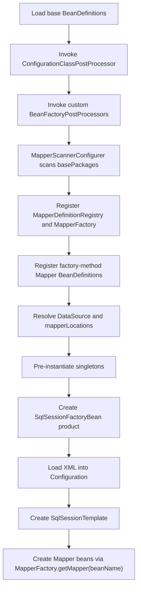
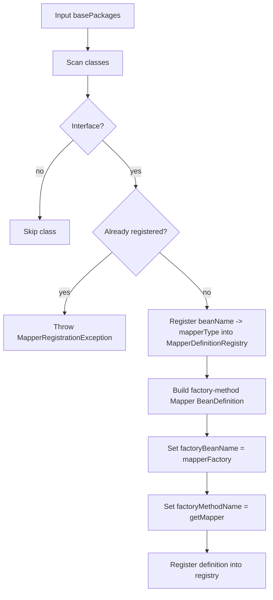
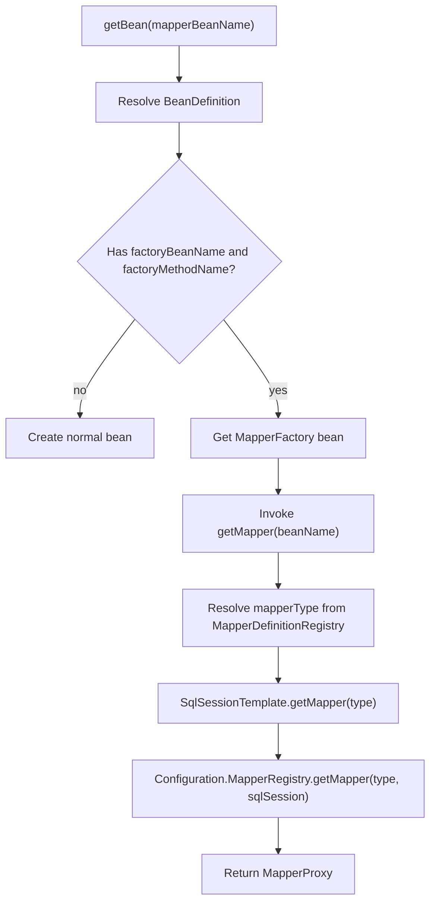

# Integration Phase 1: Mapper Bean Bootstrap

## 1. 目标与范围（必须/不做）

### 目标
- 在 mini-spring `refresh` 启动阶段完成 Mapper 接口扫描、BeanDefinition 注册与等价工厂模型装配。
- 由容器托管 `SqlSessionFactoryBean`，完成 `Configuration` 初始化、XML 映射加载与 `MapperRegistry` 注册。
- 让业务层通过 `getBean(mapper)` 获取 Mapper 代理 Bean，并打通 mini-mybatis 基础查询闭环。

### 必须范围
- mini-spring 前置改造：执行自定义 `BeanFactoryPostProcessor`
- `MapperScannerConfigurer`
- `ClassPathMapperScanner`
- `MapperDefinitionRegistry`
- `MapperFactory`
- `SqlSessionFactoryBean`
- `SqlSessionTemplate` 最小门面
- XML `mapperLocations` 加载
- `Configuration` 初始化与 `MapperRegistry` 注册
- `FAIL_FAST` 冲突策略

### 不做
- 连接池实现
- 完整事务管理
- XML 热加载
- JavaConfig 导入入口
- 插件链
- 注解 SQL 映射
- 原生 `FactoryBean` SPI
- `BeanDefinitionRegistryPostProcessor`

## 2. 设计与关键决策

### 包结构（com.xujn）
```text
com.xujn.minispring.integration.mybatis
├── scanner
│   ├── MapperScanner
│   ├── ClassPathMapperScanner
│   └── MapperScannerConfigurer
├── factory
│   ├── MapperFactory
│   ├── SqlSessionFactoryBean
│   └── MapperBeanDefinitionFactory
├── support
│   ├── SqlSessionTemplate
│   ├── MapperDefinitionRegistry
│   ├── MapperBeanNameGenerator
│   └── ResourcePatternResolver
└── exception
    ├── MapperRegistrationException
    ├── MappingLoadException
    ├── StatementConflictException
    └── MissingDataSourceException

com.xujn.minimybatis
├── binding
│   ├── MapperProxy
│   └── MapperRegistry
├── builder
│   └── xml
├── mapping
├── executor
└── session

com.xujn.minispring
├── beans
├── context
└── aop
```

- `integration.mybatis.scanner`
  - 目的：扫描 Mapper 接口并注册工厂方法型 BeanDefinition。
  - 最小实现要点：按包扫描；只接受接口；把 `beanName -> mapperInterface` 注册到 `MapperDefinitionRegistry`。
  - 边界：不创建代理实例；不加载 XML。
  - 可选增强：注解过滤、排除规则、BeanName 生成策略。
  - 依赖关系：`integration -> mini-spring BFPP/registry`，`integration -> mini-mybatis binding metadata`
- `integration.mybatis.factory`
  - 目的：把容器创建流程桥接到 mybatis 运行时对象。
  - 最小实现要点：`MapperFactory` 产出 Mapper 代理；`SqlSessionFactoryBean` 产出 `SqlSessionFactory`。
  - 边界：不管理事务提交；不负责 AOP。
  - 可选增强：延迟初始化、多工厂引用。
  - 依赖关系：`integration -> mini-spring factory-method bean definition`，`integration -> mini-mybatis session/configuration`
- `integration.mybatis.support`
  - 目的：提供模板门面、资源解析与 mapper 元数据注册。
  - 最小实现要点：`SqlSessionTemplate` 统一获取和关闭 `SqlSession`；`MapperDefinitionRegistry` 保存 mapper 类型。
  - 边界：不改写 BeanFactory 主流程。
  - 可选增强：事务同步、资源缓存。
  - 依赖关系：`integration -> mini-mybatis session`，`integration -> mini-spring resource abstraction`

### 前置容器改造
- 目的：补齐当前 mini-spring 无法直接承载集成方案的最小 SPI。
- 最小实现要点：
  - `AnnotationConfigApplicationContext.refresh()` 在执行完内置 `ConfigurationClassPostProcessor` 后，继续发现并执行用户自定义 `BeanFactoryPostProcessor`
  - `BeanDefinition` 补充工厂方法字面量参数能力，用于把 mapper BeanName 传入 `MapperFactory#getMapper(beanName)`
  - 继续复用现有 `factoryBeanName + factoryMethodName` BeanDefinition 模型
- 边界：
  - 不补原生 `FactoryBean`
  - 不补 `BeanDefinitionRegistryPostProcessor`
- 可选增强：
  - 原生 `FactoryBean`
  - 通用 BeanDefinition 属性注入
- 依赖关系：`integration -> mini-spring context`

> [注释] 生命周期：refresh 阶段顺序必须先支持自定义 BFPP，Mapper 扫描才能稳定落位
> - 背景：当前 mini-spring 只会执行内置 `ConfigurationClassPostProcessor`，不会自动执行业务自定义 BFPP，工厂方法也不能直接拿到 mapper BeanName 这类字面量参数。
> - 影响：如果不先补这个执行链，`MapperScannerConfigurer` 根本不会在 `refresh` 期间生效。
> - 取舍：先补最小 BFPP 执行能力和工厂方法参数传递能力，不直接引入完整 Spring 风格 SPI。
> - 可选增强：后续扩展为 `BeanDefinitionRegistryPostProcessor`。

### 核心组件接口草图

#### MapperScanner
- 目的：统一扫描入口与候选类型判定。
- 最小实现要点：输入 `basePackages`，输出 Mapper 接口集合。
- 边界：只负责扫描结果，不负责实例创建。
- 可选增强：支持 `ANNOTATION` 模式。
- 依赖关系：`integration -> mini-spring scanning`

```java
public interface MapperScanner {
    Set<Class<?>> scan(String... basePackages);
    boolean isCandidateComponent(Class<?> beanClass);
}
```

#### MapperFactory
- 目的：通过工厂方法语义将 Mapper 接口包装成容器产品对象。
- 最小实现要点：根据 BeanName 找到 mapper 接口，再通过 `SqlSessionTemplate` 返回代理。
- 边界：不向业务层暴露 `SqlSession`。
- 可选增强：懒加载、原型模式。
- 依赖关系：`integration -> mini-spring factory-method`，`integration -> mini-mybatis MapperRegistry`

```java
public class MapperFactory {
    public void setMapperDefinitionRegistry(MapperDefinitionRegistry registry);
    public void setSqlSessionTemplate(SqlSessionTemplate sqlSessionTemplate);
    public Object getMapper(String beanName);
}
```

#### SqlSessionFactoryBean
- 目的：在容器预实例化阶段构建 `SqlSessionFactory` 与 `Configuration`。
- 最小实现要点：接收 `DataSource`、`mapperLocations`、冲突策略并完成 XML 注册。
- 边界：单数据源；XML 模式。
- 可选增强：类型别名、插件、事务工厂。
- 依赖关系：`integration -> mini-spring bean wiring`，`integration -> mini-mybatis Configuration`

```java
public class SqlSessionFactoryBean {
    private DataSource dataSource;
    private String configLocation;
    private String[] mapperLocations;
    private boolean failFast;
    private ConflictPolicy conflictPolicy;

    public SqlSessionFactory buildSqlSessionFactory();
}
```

#### SqlSessionTemplate
- 目的：为 `MapperFactory` 和业务调用提供线程安全门面。
- 最小实现要点：封装 `selectOne`、`selectList`、`getMapper`。
- 边界：Phase 1 不实现事务绑定。
- 可选增强：更新语句、事务同步。
- 依赖关系：`integration -> mini-mybatis SqlSessionFactory`

```java
public interface SqlSessionTemplate {
    <T> T selectOne(String statement, Object parameter);
    <E> List<E> selectList(String statement, Object parameter);
    <T> T getMapper(Class<T> mapperType);
}
```

#### MapperDefinitionRegistry
- 目的：保存 mapper 接口元数据，替代当前 mini-spring 不具备的通用属性注入。
- 最小实现要点：维护 `beanName -> mapperInterface` 与反向映射。
- 边界：只保存元数据，不保存运行态对象。
- 可选增强：按 `sqlSessionFactoryRef` 分组。
- 依赖关系：`integration -> mini-spring registry`，`integration -> mini-mybatis mapper metadata`

```java
public class MapperDefinitionRegistry {
    public void register(String beanName, Class<?> mapperType);
    public Class<?> getMapperType(String beanName);
    public boolean containsBeanName(String beanName);
}
```

### 生命周期对齐点（refresh 阶段）
> [注释] Mapper 扫描与 BeanDefinition 注册时机必须对齐当前 mini-spring 的真实 refresh 顺序
> - 背景：当前容器没有 `BeanDefinitionRegistryPostProcessor`，也没有原生 `FactoryBean`。
> - 影响：Phase 1 不能沿用原文档中的 Spring 完整模型，必须改用“自定义 BFPP + 工厂方法型 BeanDefinition”。
> - 取舍：先在 BFPP 中完成接口扫描和定义注册，再在单例预实例化阶段通过 `MapperFactory` 产出代理。
> - 可选增强：后续升级成原生 `FactoryBean`。

- refresh 对齐顺序
  1. 加载基础 BeanDefinition。
  2. 执行内置 `ConfigurationClassPostProcessor`。
  3. 执行自定义 `BeanFactoryPostProcessor`。
  4. `MapperScannerConfigurer` 按包扫描并注册 `MapperDefinitionRegistry`、`MapperFactory`、Mapper BeanDefinitions。
  5. 解析 `mapperLocations` 与 `DataSource` 依赖。
  6. 注册 `BeanPostProcessor` 与 AOP 相关增强器。
  7. 预实例化单例。
  8. 创建 `SqlSessionFactoryBean` 产品对象，完成 XML 加载与 `Configuration` 初始化。
  9. 创建 `SqlSessionTemplate`。
  10. 通过 `MapperFactory.getMapper(beanName)` 返回 Mapper 代理。

### 冲突/错误策略
> [注释] 映射加载失败/重复 mapper/重复 statementId 必须在启动期 fail-fast
> - 背景：这些都属于配置错误，不应延迟到首次查询时暴露。
> - 影响：`SqlSessionFactoryBean` 初始化必须完整解析 XML，并执行全量冲突检查；扫描阶段必须校验 Mapper 重复。
> - 取舍：默认 `FAIL_FAST`；不提供静默覆盖。
> - 可选增强：开发模式输出全量冲突报告。

- `MissingDataSourceException`
  - 目的：阻止在无 `DataSource` 条件下创建 `SqlSessionFactory`。
  - 最小实现要点：错误信息必须包含 `beanName` 与依赖引用名。
  - 边界：启动期抛出；不降级。
  - 可选增强：给出候选 `DataSource` Bean 列表。
  - 依赖关系：`integration -> mini-spring bean resolution`
- `MappingLoadException`
  - 目的：暴露 XML 资源不可读、格式错误、namespace 缺失等问题。
  - 最小实现要点：错误信息必须包含 `resourcePath`。
  - 边界：启动期抛出；不跳过坏资源。
  - 可选增强：附带 XML 行号。
  - 依赖关系：`integration -> mini-mybatis XML builder`
- `StatementConflictException`
  - 目的：阻止重复 `statementId` 进入 `Configuration`。
  - 最小实现要点：错误信息包含旧资源和新资源。
  - 边界：默认不覆盖。
  - 可选增强：显式 `OVERRIDE`。
  - 依赖关系：`integration -> mini-mybatis mappedStatements`

## 3. 流程与图

### 图 1：refresh 阶段集成最小闭环
**标题：Phase 1 refresh 集成总流程**  
**覆盖范围说明：展示当前 mini-spring 下扫描、注册、工厂创建、模板装配、Mapper 代理暴露的完整启动顺序。**



### 图 2：MapperScanner 到 BeanDefinition 注册流程
**标题：MapperScanner 注册流程**  
**覆盖范围说明：展示 Mapper 接口如何转换为工厂方法型 BeanDefinition。**



### 图 3：工厂方法分支创建 Mapper Bean
**标题：Mapper Bean 工厂方法创建流程**  
**覆盖范围说明：展示 `getBean(mapper)` 如何经由 `MapperFactory` 返回 `MapperProxy`。**



> [注释] FactoryBean/BeanDefinition 生成动态代理的策略在 Phase 1 采用“FactoryBean 语义、工厂方法实现”
> - 背景：当前 mini-spring 没有原生 `FactoryBean` SPI，但已经支持工厂方法型 BeanDefinition。
> - 影响：文档中的工厂语义仍成立，但实现承载点改为 `MapperFactory#getMapper(beanName)`。
> - 取舍：不在容器 `createBean` 中增加 Mapper 接口专用特判。
> - 可选增强：后续补齐 `FactoryBean` 后可无缝替换内部实现。

## 4. 验收标准（可量化）
- 扫描指定 `basePackages` 后，所有符合规则的 Mapper 接口均注册为工厂方法型 `BeanDefinition`。
- 所有 Mapper BeanDefinition 均携带 `beanName` 字面量工厂方法参数，用于驱动 `MapperFactory#getMapper(beanName)`。
- 容器 `refresh` 完成后，`SqlSessionFactory`、`SqlSessionTemplate`、Mapper Bean 均可通过 `getBean` 获取。
- `SqlSessionFactoryBean` 初始化阶段成功加载全部 XML 并注册到 `Configuration.mappedStatements`。
- 同一 Mapper BeanName 的两次 `getBean` 返回同一代理实例。
- 缺失 `DataSource` 时启动失败，错误信息包含缺失依赖引用。
- XML 资源不存在或不可读时启动失败，错误信息包含资源路径。
- 重复 `statementId` 时启动失败，错误信息同时包含旧资源和新资源。
- 重复 Mapper 接口注册时启动失败，错误信息包含 `mapperClass` 与扫描包。
- mini-spring 未执行自定义 `BeanFactoryPostProcessor` 时，Mapper Bean 不得被静默跳过，必须暴露启动失败或明确验收失败。

## 5. Git 交付计划
- branch: `feature/integration-mybatis-spring-phase-1-bootstrap`
- PR title: `feat(integration): bootstrap mapper beans with scanner and factory method model`
- commits（>=8 条，Angular 格式 + 文件路径）：
  - `feat(spring-context): invoke custom bean factory post processors during refresh` -> `/Users/xjn/Develop/projects/java/mini-spring/src/main/java/com/xujn/minispring/context/support/AnnotationConfigApplicationContext.java`
  - `feat(scanner): add mapper scanner contract for package-based registration` -> `/Users/xjn/Develop/projects/java/mini-mybatis/src/main/java/com/xujn/minispring/integration/mybatis/scanner/MapperScanner.java`
  - `feat(scanner): register mapper factory-method bean definitions during refresh` -> `/Users/xjn/Develop/projects/java/mini-mybatis/src/main/java/com/xujn/minispring/integration/mybatis/scanner/MapperScannerConfigurer.java`, `/Users/xjn/Develop/projects/java/mini-mybatis/src/main/java/com/xujn/minispring/integration/mybatis/scanner/ClassPathMapperScanner.java`
  - `feat(support): add mapper definition registry for mapper metadata lookup` -> `/Users/xjn/Develop/projects/java/mini-mybatis/src/main/java/com/xujn/minispring/integration/mybatis/support/MapperDefinitionRegistry.java`
  - `feat(factory): add mapper factory for mapper proxy products` -> `/Users/xjn/Develop/projects/java/mini-mybatis/src/main/java/com/xujn/minispring/integration/mybatis/factory/MapperFactory.java`, `/Users/xjn/Develop/projects/java/mini-mybatis/src/main/java/com/xujn/minispring/integration/mybatis/factory/MapperBeanDefinitionFactory.java`
  - `feat(factory): add sql session factory bean for configuration bootstrap` -> `/Users/xjn/Develop/projects/java/mini-mybatis/src/main/java/com/xujn/minispring/integration/mybatis/factory/SqlSessionFactoryBean.java`
  - `feat(support): introduce sql session template for mapper bean access` -> `/Users/xjn/Develop/projects/java/mini-mybatis/src/main/java/com/xujn/minispring/integration/mybatis/support/SqlSessionTemplate.java`
  - `feat(exception): add startup failure exceptions for datasource and mapping conflicts` -> `/Users/xjn/Develop/projects/java/mini-mybatis/src/main/java/com/xujn/minispring/integration/mybatis/exception/MissingDataSourceException.java`, `/Users/xjn/Develop/projects/java/mini-mybatis/src/main/java/com/xujn/minispring/integration/mybatis/exception/MappingLoadException.java`, `/Users/xjn/Develop/projects/java/mini-mybatis/src/main/java/com/xujn/minispring/integration/mybatis/exception/StatementConflictException.java`
  - `test(integration): cover mapper registration and xml bootstrap failures` -> `/Users/xjn/Develop/projects/java/mini-mybatis/src/test/java/com/xujn/minispring/integration/mybatis/Phase1BootstrapTest.java`, `/Users/xjn/Develop/projects/java/mini-mybatis/src/test/resources/mybatis/duplicate-statement-mapper.xml`
  - `docs(integration): align phase 1 integration design with current mini-spring spi` -> `/Users/xjn/Develop/projects/java/mini-mybatis/docs/integration-mybatis-spring-phase-1.md`, `/Users/xjn/Develop/projects/java/mini-mybatis/tests/acceptance-integration-mybatis-spring-phase-1.md`
