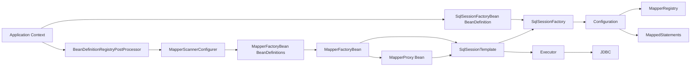
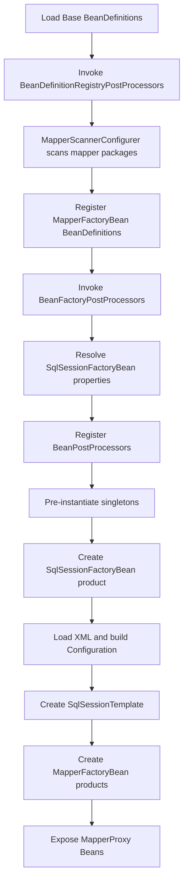
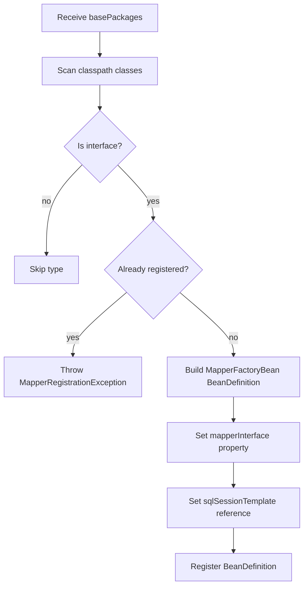
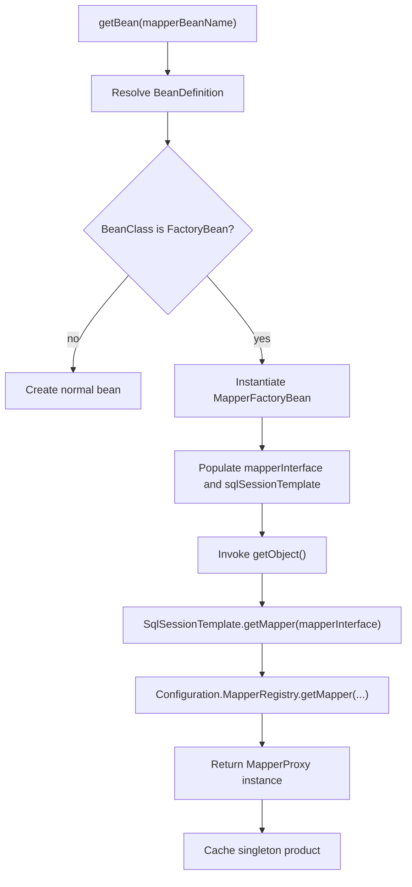
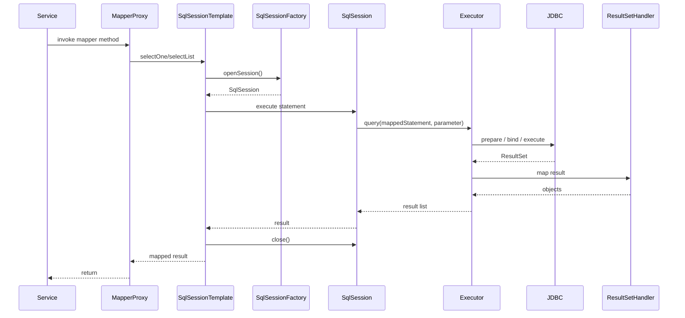
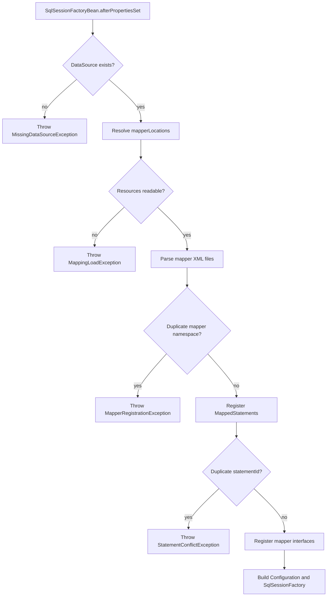

# 1. 背景与目标

## 集成目标与非目标

### 集成目标
- 让 `Mapper` 接口通过 mini-spring 容器扫描后注册为 Bean，最终实例为 `MapperProxy`。
- 让 `SqlSessionFactory`、`SqlSessionTemplate`、`Configuration` 由容器托管，并在 `refresh` 生命周期内完成初始化。
- 让 XML 映射加载、`MappedStatement` 注册、`MapperRegistry` 注册与容器启动顺序对齐。
- 明确 `DataSource`、`Connection`、`SqlSession` 的职责边界与资源释放策略。
- 让集成层通过 `BeanDefinitionRegistryPostProcessor`、`BeanFactoryPostProcessor`、`FactoryBean`、`BeanPostProcessor` 等扩展点工作，不侵入 BeanFactory 主流程。
- 为后续事务、插件、JavaConfig、AOP 协同预留演进接口。

### 非目标
- 不实现连接池。
- 不实现完整事务管理，只定义事务协同边界。
- 不实现 XML 热更新监听线程。
- 不实现完整 JavaConfig 解析器，只定义配置入口契约。
- 不改造 mini-spring BeanFactory 主创建流程，只在扩展点侧接入。

## 术语表
| 术语 | 定义 |
| --- | --- |
| `MapperScanner` | 扫描指定包下的 Mapper 接口，并产出 `MapperFactoryBean` 对应的 `BeanDefinition` |
| `MapperFactoryBean` | 由容器管理的工厂 Bean，负责把 Mapper 接口转换为 `MapperProxy` 实例 |
| `SqlSessionFactoryBean` | 由容器管理的工厂 Bean，负责组装 `Configuration`、加载 XML 并构建 `SqlSessionFactory` |
| `SqlSessionTemplate` | 线程安全门面，负责屏蔽 `SqlSession` 获取、关闭与异常边界 |
| `MapperProxy` | mini-mybatis 中的动态代理实现，负责把接口方法路由到 `SqlSession` |
| `MapperRegistry` | mini-mybatis 中的 Mapper 注册中心，维护接口类型与代理工厂映射 |
| `Configuration` | mini-mybatis 全局配置中心，持有 `DataSource`、`MappedStatement`、Mapper 注册信息 |
| `BeanDefinitionRegistryPostProcessor` | mini-spring 容器扩展点，用于在 Bean 实例化前补充或修改 `BeanDefinition` |
| `BeanFactoryPostProcessor` | mini-spring 容器扩展点，用于在 BeanFactory 初始化后修正属性、资源与依赖 |
| `FactoryBean` | 容器创建逻辑中的工厂语义，`getBean` 返回产品对象而不是工厂自身 |

## com.xujn 包结构建议（integration 模块与依赖关系）
```text
com.xujn
├── minimybatis
│   ├── binding
│   ├── builder
│   ├── executor
│   ├── mapping
│   ├── reflection
│   └── session
├── minispring
│   ├── beans
│   ├── context
│   ├── aop
│   └── core
└── minispring.integration.mybatis
    ├── annotation
    │   └── MapperScan
    ├── scanner
    │   ├── MapperScanner
    │   ├── ClassPathMapperScanner
    │   └── MapperScannerConfigurer
    ├── factory
    │   ├── MapperFactoryBean
    │   ├── SqlSessionFactoryBean
    │   └── FactoryBeanSupport
    ├── support
    │   ├── SqlSessionTemplate
    │   ├── MybatisIntegrationRegistrar
    │   ├── MapperBeanNameGenerator
    │   └── ResourcePatternResolver
    ├── config
    │   ├── MybatisProperties
    │   └── MybatisConfigurationLoader
    └── exception
        ├── MapperRegistrationException
        ├── MappingLoadException
        ├── StatementConflictException
        └── MissingDataSourceException
```

- `minispring.integration.mybatis -> minispring`
  - 目的：复用容器扩展点、BeanDefinition 模型、Bean 生命周期钩子。
  - 最小实现要点：只依赖扫描、注册、FactoryBean、BPP/BFPP 扩展。
  - 边界：不反向依赖 mini-mybatis 内部执行器实现。
  - 可选增强：接入 JavaConfig 导入器。
  - 依赖关系：`integration -> mini-spring`
- `minispring.integration.mybatis -> minimybatis`
  - 目的：把 `Configuration`、`MapperRegistry`、`SqlSessionFactory`、`MapperProxy` 接入容器。
  - 最小实现要点：调用公开接口完成注册、工厂创建、代理获取。
  - 边界：不绕过 `Configuration` 直接注册 statement。
  - 可选增强：增加插件与事务适配器。
  - 依赖关系：`integration -> mini-mybatis`

# 2. 集成能力清单（必须/可选/不做）

## 必须能力
| 能力 | 目的 | 最小实现要点 | 边界（支持/不支持） | 可选增强 | 依赖关系 |
| --- | --- | --- | --- | --- | --- |
| Mapper 扫描注册 | 让 Mapper 接口在容器启动时进入 BeanDefinition 注册表 | 基于包扫描识别接口；为每个接口注册 `MapperFactoryBean` 定义 | 支持接口；不支持普通类直接代理 | 增加注解过滤 | `integration -> mini-spring` 扫描与注册；`integration -> mini-mybatis` MapperRegistry |
| `SqlSessionFactory` 托管 | 统一构建持久层入口工厂 | 以 `SqlSessionFactoryBean` 接收 `DataSource`、XML 资源并创建 `Configuration` | 支持单数据源；不支持多环境路由 | 增加多数据源命名绑定 | `integration -> mini-spring` FactoryBean；`integration -> mini-mybatis` Configuration |
| `Configuration` 初始化 | 在容器启动阶段完成 SQL 映射与 Mapper 注册 | 加载 XML、校验冲突、注册 `MappedStatement`、注册 Mapper | 支持 XML；不支持注解 SQL | 增加 JavaConfig 配置桥接 | `integration -> mini-mybatis` builder 与 mapping；`integration -> mini-spring` 资源解析 |
| Mapper 代理 Bean 化 | 让业务层通过 `getBean` 获取 Mapper 代理 | `MapperFactoryBean#getObject()` 返回 `SqlSessionTemplate.getMapper(type)` | 支持单例 Bean 语义；不支持 prototype Mapper | 增加懒加载 | `integration -> mini-spring` FactoryBean；`integration -> mini-mybatis` MapperProxy |
| refresh 生命周期对齐 | 在实例化前完成注册与配置装配 | 扫描发生在注册后处理阶段；工厂构建发生在单例预实例化阶段 | 支持 fail-fast 初始化；不支持启动后增量热注册 | 增加热加载刷新入口 | `integration -> mini-spring` refresh 扩展点 |
| DataSource/Connection 边界 | 明确资源获取和关闭责任 | `SqlSessionFactoryBean` 只接收 `DataSource`；`SqlSessionTemplate` 负责会话关闭；Executor 负责 JDBC 资源关闭 | 不实现连接池；不实现事务绑定 | 增加事务同步连接管理器 | `integration -> mini-spring` Bean 引用；`integration -> mini-mybatis` session/executor |

## 可选能力
| 能力 | 目的 | 最小实现要点 | 边界（支持/不支持） | 可选增强 | 依赖关系 |
| --- | --- | --- | --- | --- | --- |
| XML 映射热加载 | 缩短调试回路 | 提供显式刷新入口重新解析 mapper XML | 不自动监听文件变化 | 文件监听与增量替换 | `integration -> mini-spring` 上下文事件；`integration -> mini-mybatis` Configuration 重载 |
| 事务协同 | 让同线程调用共享连接与提交边界 | 预留 `ConnectionHolder` 与事务同步接口 | 当前不提交/回滚 | 声明式事务 | `integration -> mini-spring` 事务模块；`integration -> mini-mybatis` Executor |
| 插件扩展 | 为 SQL 执行链增加拦截点 | 预留拦截器列表装配入口 | 当前不执行插件链 | Statement/Executor 拦截器 | `integration -> mini-mybatis` executor |
| JavaConfig 配置入口 | 让容器通过配置类声明集成 | 定义 `@MapperScan`、`MybatisConfigurer` 导入器契约 | 当前文档只定义入口 | 完整 `@Configuration` 导入流程 | `integration -> mini-spring` 注解配置模块 |

## 不做能力
| 能力 | 目的 | 最小实现要点 | 边界（支持/不支持） | 可选增强 | 依赖关系 |
| --- | --- | --- | --- | --- | --- |
| 连接池实现 | 管理连接复用 | 不在集成层实现 | 容器只依赖外部 `DataSource` | 接外部连接池 | `integration -> external DataSource` |
| 完整事务管理实现 | 管理事务传播、提交与回滚 | 当前只保留边界接口 | 不支持事务传播规则 | 后续对接 mini-spring transaction | `integration -> mini-spring transaction` |
| 容器主流程侵入式改造 | 直接修改 BeanFactory 核心创建逻辑 | 当前不采用 | 所有集成通过扩展点完成 | 无 | `integration -> mini-spring SPI only` |

# 3. 总体架构与依赖关系

## 总体架构图
**标题：mini-mybatis 与 mini-spring 集成总体架构图**  
**覆盖范围说明：展示 integration 模块如何连接容器启动链路与持久层运行时链路。**



## 依赖方向
- `com.xujn.minispring.integration.mybatis.scanner -> com.xujn.minispring.beans / context`
- `com.xujn.minispring.integration.mybatis.factory -> com.xujn.minispring.beans.factory`
- `com.xujn.minispring.integration.mybatis.factory -> com.xujn.minimybatis.session / builder / binding`
- `com.xujn.minispring.integration.mybatis.support -> com.xujn.minimybatis.session`
- `com.xujn.minispring.integration.mybatis.exception -> integration internal only`
- mini-spring 与 mini-mybatis 不直接互相依赖；依赖收敛在 integration 模块。

## refresh 生命周期对齐
> [注释] 集成逻辑必须嵌入 refresh 扩展阶段，而不是散落在 BeanFactory 主流程
> - 背景：容器需要先确定 BeanDefinition，再进行单例实例化；Mapper 代理与 `SqlSessionFactory` 都依赖这一顺序。
> - 影响：Mapper 扫描与 BeanDefinition 注册必须早于 `preInstantiateSingletons`；XML 映射解析和 `SqlSessionFactory` 构建必须晚于 `DataSource` Bean 可解析。
> - 取舍：扫描注册放在 `BeanDefinitionRegistryPostProcessor`；属性修正和资源定位放在 `BeanFactoryPostProcessor`；最终对象实例化仍由容器统一执行。
> - 可选增强：后续通过 `ApplicationContextInitializer` 或 JavaConfig Import Registrar 提前注入集成配置。

- `refresh` 阶段顺序建议
  1. 读取基础 BeanDefinition。
  2. 执行 `BeanDefinitionRegistryPostProcessor`。
  3. 运行 `MapperScannerConfigurer`，注册 `MapperFactoryBean` 与必要的基础设施 BeanDefinition。
  4. 执行 `BeanFactoryPostProcessor`，解析 `mapperLocations`、校验 `SqlSessionFactoryBean` 属性。
  5. 执行 `BeanPostProcessor` 注册。
  6. 预实例化单例 Bean。
  7. 创建 `SqlSessionFactoryBean` 产品对象，完成 `Configuration` 与 XML 初始化。
  8. 创建 `MapperFactoryBean` 产品对象，得到 Mapper 代理 Bean。

# 4. 关键模块与包结构（com.xujn）

## 建议包结构
```text
com.xujn.minispring.integration.mybatis
├── annotation
│   └── MapperScan
├── scanner
│   ├── MapperScanner
│   ├── ClassPathMapperScanner
│   └── MapperScannerConfigurer
├── factory
│   ├── MapperFactoryBean
│   ├── SqlSessionFactoryBean
│   └── FactoryBeanSupport
├── support
│   ├── SqlSessionTemplate
│   ├── MybatisIntegrationRegistrar
│   ├── MapperBeanNameGenerator
│   └── ResourcePatternResolver
├── config
│   ├── MybatisProperties
│   └── MybatisConfigurationLoader
└── exception
    ├── MapperRegistrationException
    ├── MappingLoadException
    ├── StatementConflictException
    └── MissingDataSourceException
```

## 包职责与边界

### `com.xujn.minispring.integration.mybatis.annotation`
- 目的：为后续 JavaConfig 提供声明式入口。
- 最小实现要点：定义 `@MapperScan` 元注解契约。
- 边界：当前不负责执行扫描。
- 可选增强：支持 `sqlSessionFactoryRef`、过滤器。
- 依赖关系：`integration -> mini-spring annotation metadata`

### `com.xujn.minispring.integration.mybatis.scanner`
- 目的：处理 Mapper 接口发现与 BeanDefinition 注册。
- 最小实现要点：根据 `basePackages` 扫描 classpath，只接收接口类型。
- 边界：不负责 XML 加载，不直接创建代理实例。
- 可选增强：支持注解过滤、命名生成器。
- 依赖关系：`integration -> mini-spring registry`；`integration -> mini-mybatis binding metadata`

### `com.xujn.minispring.integration.mybatis.factory`
- 目的：承载 FactoryBean 语义，把容器 Bean 创建桥接到 mybatis 运行时对象。
- 最小实现要点：`MapperFactoryBean` 产出代理，`SqlSessionFactoryBean` 产出工厂。
- 边界：不承担事务提交，不承担 AOP。
- 可选增强：支持延迟初始化与多工厂引用。
- 依赖关系：`integration -> mini-spring FactoryBean`；`integration -> mini-mybatis session/configuration`

### `com.xujn.minispring.integration.mybatis.support`
- 目的：提供模板门面、资源解析和集成注册辅助能力。
- 最小实现要点：`SqlSessionTemplate` 管理会话边界；资源解析器加载 XML。
- 边界：不直接注册 BeanDefinition。
- 可选增强：支持事务同步、资源缓存。
- 依赖关系：`integration -> mini-mybatis session/executor`；`integration -> mini-spring resource abstraction`

### `com.xujn.minimybatis.*`
- 目的：复用已有持久层核心模型和执行链。
- 最小实现要点：暴露 `Configuration`、`SqlSessionFactory`、`MapperRegistry`、`MapperProxy`。
- 边界：不依赖容器 API。
- 可选增强：开放插件与事务接口。
- 依赖关系：被 `integration` 依赖。

### `com.xujn.minispring.*`
- 目的：提供容器扩展点与 Bean 生命周期基础设施。
- 最小实现要点：支持 BeanDefinition、FactoryBean、BFPP、BPP、AOP。
- 边界：不直接理解 SQL 映射。
- 可选增强：JavaConfig、事件系统、事务模块。
- 依赖关系：被 `integration` 依赖。

# 5. 核心数据结构与接口草图

## MapperScanner 接口草图
- 目的：统一 Mapper 扫描输入与 BeanDefinition 输出。
- 最小实现要点：接收包路径、过滤规则，输出待注册定义集合。
- 边界：只处理类型发现，不创建实例。
- 可选增强：支持注解过滤和排除规则。
- 依赖关系：`integration -> mini-spring registry`

```java
public interface MapperScanner {
    Set<BeanDefinition> scan(String... basePackages);
    boolean isCandidateComponent(Class<?> beanClass);
}
```

## MapperFactoryBean 接口草图
- 目的：通过 FactoryBean 语义把 Mapper 接口转为可注入 Bean。
- 最小实现要点：返回代理对象、返回接口类型、声明单例语义。
- 边界：不暴露 `SqlSession` 给业务层。
- 可选增强：支持延迟创建和自定义 Bean 名称。
- 依赖关系：`integration -> mini-spring FactoryBean`；`integration -> mini-mybatis SqlSessionTemplate`

```java
public class MapperFactoryBean<T> implements FactoryBean<T> {
    public void setMapperInterface(Class<T> mapperInterface);
    public void setSqlSessionTemplate(SqlSessionTemplate sqlSessionTemplate);
    public T getObject();
    public Class<?> getObjectType();
    public boolean isSingleton();
}
```

## SqlSessionFactoryBean 字段列表
- 目的：统一承接容器配置并组装 `SqlSessionFactory`。
- 最小实现要点：
  - `DataSource dataSource`
  - `String configLocation`
  - `String[] mapperLocations`
  - `String[] typeAliasesPackages`
  - `Properties configurationProperties`
  - `boolean failFast`
  - `ConflictPolicy conflictPolicy`
- 边界：
  - 支持 XML 资源路径
  - 不支持多数据源聚合
- 可选增强：
  - 插件列表
  - 对象工厂
  - 事务工厂
- 依赖关系：`integration -> mini-spring bean properties`；`integration -> mini-mybatis Configuration`

```java
public class SqlSessionFactoryBean implements FactoryBean<SqlSessionFactory> {
    private DataSource dataSource;
    private String configLocation;
    private String[] mapperLocations;
    private String[] typeAliasesPackages;
    private Properties configurationProperties;
    private boolean failFast;
    private ConflictPolicy conflictPolicy;
}
```

## SqlSessionTemplate 接口草图
- 目的：为业务层和 `MapperFactoryBean` 提供线程安全调用门面。
- 最小实现要点：封装查询、更新、获取 Mapper、关闭语义。
- 边界：模板自身不暴露底层连接。
- 可选增强：事务同步会话复用。
- 依赖关系：`integration -> mini-mybatis SqlSessionFactory`

```java
public interface SqlSessionTemplate {
    <T> T selectOne(String statement);
    <T> T selectOne(String statement, Object parameter);
    <E> List<E> selectList(String statement);
    <E> List<E> selectList(String statement, Object parameter);
    int update(String statement, Object parameter);
    <T> T getMapper(Class<T> mapperType);
}
```

## 冲突与错误模型
- 目的：让启动失败和运行失败具备可定位的错误输出。
- 最小实现要点：
  - 异常类型独立
  - 错误信息包含 `mapperClass`、`statementId`、`resourcePath`
  - `FAIL_FAST` 为默认冲突策略
- 边界：
  - 启动期冲突直接中止 `refresh`
  - 运行期 Mapper 方法缺失直接抛框架异常
- 可选增强：
  - 错误码
  - 结构化诊断对象
- 依赖关系：`integration -> mini-spring refresh exception path`；`integration -> mini-mybatis mapping metadata`

| 异常类型 | 触发场景 | 错误信息要求 |
| --- | --- | --- |
| `MissingDataSourceException` | `SqlSessionFactoryBean` 初始化时未解析到 `DataSource` | 必须包含 beanName 与依赖引用名 |
| `MappingLoadException` | XML 资源不存在、不可读、格式错误 | 必须包含资源路径与 mapper namespace |
| `StatementConflictException` | 同一 `statementId` 重复注册 | 必须包含 `statementId`、旧资源路径、新资源路径 |
| `MapperRegistrationException` | Mapper 接口重复注册或接口不合法 | 必须包含 `mapperClass` 与扫描来源包 |
| `MapperBindingException` | Mapper 方法找不到映射语句 | 必须包含 `mapperClass`、`methodName`、`statementId` |

# 6. 核心流程（必须包含至少 5 张 Mermaid）

## 图 1：refresh 集成总流程图
**标题：mini-spring refresh 与 mybatis 集成总流程**  
**覆盖范围说明：展示扫描、注册、工厂初始化、单例预实例化之间的顺序关系。**



> [注释] refresh 阶段顺序决定了 Mapper Bean 是否能在预实例化期间稳定创建
> - 背景：Mapper Bean 依赖 `SqlSessionTemplate`，后者又依赖 `SqlSessionFactory` 与 `Configuration`。
> - 影响：如果扫描注册晚于单例预实例化，Mapper Bean 不会进入实例化队列；如果 `SqlSessionFactory` 初始化晚于 Mapper 创建，会出现依赖缺失。
> - 取舍：把扫描和注册前移到注册后处理阶段，把工厂创建保留在容器统一实例化阶段。
> - 可选增强：增加基础设施 Bean 的依赖顺序校验器，在 `refresh` 早期输出诊断信息。

## 图 2：MapperScanner -> BeanDefinition 注册流程图
**标题：MapperScanner BeanDefinition 注册流程**  
**覆盖范围说明：展示包扫描、接口过滤、冲突检查、BeanDefinition 组装的处理路径。**



> [注释] Mapper 扫描与 BeanDefinition 注册必须在实例化前完成，默认采用 fail-fast 冲突策略
> - 背景：Mapper 是接口类型，容器无法通过默认构造路径创建实例，必须先注册为 `MapperFactoryBean`。
> - 影响：扫描阶段需要同时完成候选检查、重名检查和依赖引用写入，否则后续 `getBean` 会在运行期失败。
> - 取舍：默认 `FAIL_FAST`，发现重复 Mapper 立刻终止启动，而不是覆盖旧定义。
> - 可选增强：提供显式 `OVERRIDE` 开关，仅对测试或局部覆盖场景开放。

## 图 3：getBean(mapper) 创建流程（FactoryBean 分支）
**标题：Mapper Bean 创建的 FactoryBean 分支流程**  
**覆盖范围说明：展示容器在获取 Mapper Bean 时如何走工厂语义并返回代理对象。**



> [注释] FactoryBean 策略让 Mapper 代理创建逻辑留在扩展层，而不是侵入 createBean 主分支
> - 背景：Mapper Bean 的真实类型不是接口本身，也不是普通 class，而是运行时代理对象。
> - 影响：容器只需要识别 `FactoryBean` 语义，不需要理解 Mapper 代理的内部构造。
> - 取舍：采用 `FactoryBean` 而不是在 BeanFactory 中为接口类型写专用分支，保持主流程稳定。
> - 可选增强：增加 `FactoryBeanSupport` 缓存模板，统一工厂产品单例缓存策略。

## 图 4：SqlSessionTemplate 调用链时序图
**标题：SqlSessionTemplate 到 JDBC 的调用时序**  
**覆盖范围说明：展示业务调用、模板门面、会话工厂、执行器和映射处理链的运行时顺序。**



> [注释] DataSource 与 Connection 的管理边界必须由模板层和执行层共同保证
> - 背景：容器负责注入 `DataSource`，但运行期连接开启与释放发生在 mybatis 执行链。
> - 影响：`SqlSessionTemplate` 负责会话级关闭；`Executor` 负责 `ResultSet`、`Statement`、`Connection` 的 JDBC 释放；异常路径也必须执行关闭。
> - 取舍：无事务场景下每次模板调用独立打开并关闭会话与连接，不缓存线程上下文连接。
> - 可选增强：未来引入事务同步后，由模板先查询线程绑定会话，再决定是否关闭连接。

## 图 5：资源加载与失败处理流程图
**标题：XML 映射加载与冲突失败处理流程**  
**覆盖范围说明：展示 `SqlSessionFactoryBean` 初始化阶段的资源解析、映射注册与 fail-fast 错误路径。**



> [注释] 映射加载失败、重复 mapper、重复 statementId 必须在启动期暴露，不允许延迟到首个查询请求
> - 背景：这些问题属于配置错误，拖延到运行期只会扩大故障半径。
> - 影响：`SqlSessionFactoryBean` 必须在初始化阶段完整解析 XML、注册语句并执行冲突检查。
> - 取舍：默认 `FAIL_FAST`，任何资源不可读或映射冲突都会中止容器启动。
> - 可选增强：在开发模式增加诊断报告，列出所有冲突而不是只报告首个异常。

## AOP 叠加代理说明
> [注释] Mapper 代理允许再被 AOP 代理，但 AOP 应包裹容器 Bean，不应替换 mybatis 内部代理模型
> - 背景：mini-spring 已有 BPP/AOP 扩展点，Mapper Bean 进入容器后仍可能被事务、监控或日志切面增强。
> - 影响：AOP 代理外层包裹 `MapperFactoryBean` 产物即可；`MapperProxy` 内部调用链保持不变。
> - 取舍：允许二次代理，禁止 AOP 组件直接操作 `Configuration` 或 `MapperRegistry` 内部状态。
> - 可选增强：在 AOP 元数据中识别 Mapper Bean，跳过重复接口代理优化。

# 7. 关键设计取舍与边界

## Mapper Bean 的创建策略：FactoryBean vs 直接代理
> [注释] Mapper Bean 默认采用 FactoryBean 策略，因为它最符合容器扩展式集成模型
> - 背景：Mapper 接口本身不可实例化，直接代理策略要求 BeanFactory 为接口类型内建特殊分支。
> - 影响：采用 `FactoryBean` 后，容器只处理通用工厂语义，Mapper 创建逻辑集中在集成模块。
> - 取舍：选择 `FactoryBean`，放弃在 createBean 内对 Mapper 接口写专门判断逻辑。
> - 可选增强：如果后续 mini-spring 增加实例供应器，可提供“BeanDefinition -> InstanceSupplier” 等价模型。

- 目的：降低对容器核心流程的侵入。
- 最小实现要点：所有 Mapper BeanDefinition 的 `beanClass` 指向 `MapperFactoryBean`，真实产品通过 `getObject()` 返回。
- 边界：
  - 支持单例代理
  - 不支持每次 `getBean` 新建代理
- 可选增强：
  - prototype 模式
  - 延迟代理构造
- 依赖关系：`integration -> mini-spring FactoryBean`；`integration -> mini-mybatis MapperRegistry`

## 扫描策略：按包扫描 + 接口过滤规则
- 目的：把 Mapper 发现约束在稳定、可预期的类型集合。
- 最小实现要点：
  - 输入 `basePackages`
  - 只接收接口
  - 默认不过滤注解
  - Bean 名称由类名首字母小写或自定义生成器给出
- 边界：
  - 默认 `PACKAGE`
  - 不要求 `@Mapper` 注解
- 可选增强：
  - `ANNOTATION` 模式
  - include/exclude 过滤器
- 依赖关系：`integration -> mini-spring classpath scanning`

## SqlSession 生命周期：每次调用获取连接 vs 绑定线程
- 目的：先保证资源释放正确，再为事务协同预留接口。
- 最小实现要点：
  - `SqlSessionTemplate` 每次调用创建 `SqlSession`
  - 无事务时执行后立即关闭
  - 连接不跨调用缓存
- 边界：
  - 当前不做线程绑定会话
  - 当前不做事务传播
- 可选增强：
  - 事务上下文会话复用
  - 手动会话控制
- 依赖关系：`integration -> mini-mybatis SqlSessionFactory/Executor`

## 与 AOP 的交互：MapperProxy 是否允许再被代理
- 目的：保证持久层 Bean 能与容器现有切面能力协同。
- 最小实现要点：
  - 允许 AOP 包裹 Mapper Bean
  - AOP 代理位于 `MapperProxy` 外层
  - AOP 不修改 `MapperFactoryBean` 产品缓存语义
- 边界：
  - 不支持 AOP 替换内部 `SqlSessionTemplate`
  - 不支持在切面中动态重写 `MappedStatement`
- 可选增强：
  - 特定 Advisor 跳过 Mapper Bean
  - 执行耗时监控切面
- 依赖关系：`integration -> mini-spring AOP`

## 失败策略：缺失映射、重复 statementId、mapper 冲突、DataSource 缺失
- 目的：将配置错误前移到启动期，运行错误限定在调用期。
- 最小实现要点：
  - `DataSource` 缺失：`SqlSessionFactoryBean` 初始化失败
  - XML 资源缺失：`MappingLoadException`
  - Mapper 重复：`MapperRegistrationException`
  - `statementId` 重复：`StatementConflictException`
  - Mapper 方法缺失映射：`MapperBindingException`
- 边界：
  - 默认 `FAIL_FAST`
  - 不支持静默覆盖
- 可选增强：
  - `OVERRIDE` 仅用于显式配置
  - 启动诊断报告
- 依赖关系：`integration -> mini-spring refresh abort path`；`integration -> mini-mybatis Configuration`

# 8. 开发迭代计划（Git 驱动）

## Phase 1：MapperScanner + MapperFactoryBean + SqlSessionFactoryBean
- 目标：让 Mapper 作为 Bean 成功注册、注入并可触发 mini-mybatis 最小查询闭环。
- 范围：
  - `MapperScannerConfigurer`
  - `ClassPathMapperScanner`
  - `MapperFactoryBean`
  - `SqlSessionFactoryBean`
  - `MapperRegistry` 接入
- 交付物：
  - Mapper 扫描与注册链路
  - `SqlSessionFactory` Bean 托管
  - 启动期 fail-fast 冲突校验
- 验收标准（可量化）：
  - 指定包下 Mapper 接口 100% 注册为 BeanDefinition
  - `getBean(mapper)` 返回代理对象
  - 启动阶段能完成 XML 加载并注册 statement
  - `DataSource` 缺失时容器启动失败
- 风险与缓解：
  - 风险：Mapper 扫描时机晚于单例预实例化
  - 缓解：强制走 `BeanDefinitionRegistryPostProcessor`

## Phase 2：SqlSessionTemplate + 资源加载增强 + 错误模型完善
- 目标：补齐线程安全门面、错误模型与资源解析链路。
- 范围：
  - `SqlSessionTemplate`
  - `ResourcePatternResolver`
  - XML 资源批量解析
  - 异常模型与错误信息规范
- 交付物：
  - 模板调用门面
  - 启动期资源解析器
  - 失败路径文档与验收用例
- 验收标准（可量化）：
  - `MapperFactoryBean` 统一通过 `SqlSessionTemplate` 调用
  - XML 资源不可读时抛出包含资源路径的异常
  - 重复 `statementId` 时错误信息同时包含旧资源与新资源
  - 查询异常路径中连接、语句、结果集关闭率为 100%
- 风险与缓解：
  - 风险：模板层和执行层的关闭职责重叠
  - 缓解：模板只关心 `SqlSession`，JDBC 资源由 executor 链统一关闭

## Phase 3：与 JavaConfig 配置入口协同 + 事务边界预留设计
- 目标：让集成入口不只依赖扫描配置，并为事务协同预留接入点。
- 范围：
  - `@MapperScan`
  - `MybatisIntegrationRegistrar`
  - 事务同步接口与连接持有者契约
  - AOP 协同校验
- 交付物：
  - JavaConfig 接入说明
  - 事务边界设计文档
  - AOP 叠加代理兼容策略
- 验收标准（可量化）：
  - JavaConfig 可驱动 Mapper 扫描注册
  - 事务接口引入后不修改 Phase 1/2 BeanDefinition 模型
  - Mapper Bean 经过 AOP 后仍能正常执行查询
  - 新增能力后 Phase 1/2 验收用例全部通过
- 风险与缓解：
  - 风险：JavaConfig 导入链与扫描配置重复注册 Mapper
  - 缓解：统一通过 `MapperRegistry` 与 BeanDefinition 注册表做双重去重

> [注释] 事务边界预留应建立在既有模板和工厂模型之上，不重新设计 Mapper Bean 创建路径
> - 背景：一旦事务协同引入新的会话获取方式，最容易破坏的是 `SqlSessionTemplate` 和 FactoryBean 的稳定契约。
> - 影响：Phase 3 只允许扩展模板内部会话获取策略，不允许改动 Mapper BeanDefinition 结构。
> - 取舍：把事务演进约束在 support 层与会话工厂适配层。
> - 可选增强：提供 `TransactionalSqlSessionTemplate` 包装器，而不是替换已有 MapperFactoryBean。

# 9. Git 规范（Angular Conventional Commits）

## commit message 格式
- 格式：`type(scope): subject`
- 规则：
  - `type` 使用 Angular Conventional Commits
  - `scope` 对应模块，例如 `scanner`、`factory`、`support`、`integration-docs`
  - `subject` 使用英文动词短语，描述单一变更意图

## type 列表与适用场景
- `feat`：新增扫描器、工厂、模板、配置入口
- `fix`：修复注册时序、资源定位、冲突判断、关闭逻辑
- `refactor`：调整包结构、提炼抽象、不改变外部行为
- `docs`：补充架构文档、阶段文档、验收说明
- `test`：增加集成验收、失败路径、资源释放校验
- `chore`：脚手架、示例资源、构建元数据

## 示例：每个 phase 至少 3 条示例提交

### Phase 1 示例提交
1. `feat(scanner): register mapper factory bean definitions from base packages`  
   文件路径：`/Users/xjn/Develop/projects/java/mini-mybatis/src/main/java/com/xujn/minispring/integration/mybatis/scanner/MapperScannerConfigurer.java`  
   文件路径：`/Users/xjn/Develop/projects/java/mini-mybatis/src/main/java/com/xujn/minispring/integration/mybatis/scanner/ClassPathMapperScanner.java`
2. `feat(factory): add sql session factory bean for configuration bootstrap`  
   文件路径：`/Users/xjn/Develop/projects/java/mini-mybatis/src/main/java/com/xujn/minispring/integration/mybatis/factory/SqlSessionFactoryBean.java`  
   文件路径：`/Users/xjn/Develop/projects/java/mini-mybatis/src/main/java/com/xujn/minispring/integration/mybatis/config/MybatisConfigurationLoader.java`
3. `feat(factory): expose mapper proxies through mapper factory bean`  
   文件路径：`/Users/xjn/Develop/projects/java/mini-mybatis/src/main/java/com/xujn/minispring/integration/mybatis/factory/MapperFactoryBean.java`  
   文件路径：`/Users/xjn/Develop/projects/java/mini-mybatis/src/main/java/com/xujn/minimybatis/binding/MapperRegistry.java`

### Phase 2 示例提交
1. `feat(support): add sql session template as thread-safe facade`  
   文件路径：`/Users/xjn/Develop/projects/java/mini-mybatis/src/main/java/com/xujn/minispring/integration/mybatis/support/SqlSessionTemplate.java`  
   文件路径：`/Users/xjn/Develop/projects/java/mini-mybatis/src/main/java/com/xujn/minispring/integration/mybatis/support/ResourcePatternResolver.java`
2. `feat(exception): add fail-fast mapping conflict exceptions`  
   文件路径：`/Users/xjn/Develop/projects/java/mini-mybatis/src/main/java/com/xujn/minispring/integration/mybatis/exception/StatementConflictException.java`  
   文件路径：`/Users/xjn/Develop/projects/java/mini-mybatis/src/main/java/com/xujn/minispring/integration/mybatis/exception/MappingLoadException.java`
3. `test(integration): cover resource loading and datasource missing failures`  
   文件路径：`/Users/xjn/Develop/projects/java/mini-mybatis/src/test/java/com/xujn/minispring/integration/mybatis/IntegrationBootstrapTest.java`  
   文件路径：`/Users/xjn/Develop/projects/java/mini-mybatis/src/test/resources/mybatis/duplicate-statement-mapper.xml`

### Phase 3 示例提交
1. `feat(annotation): add mapper scan annotation entry for javaconfig integration`  
   文件路径：`/Users/xjn/Develop/projects/java/mini-mybatis/src/main/java/com/xujn/minispring/integration/mybatis/annotation/MapperScan.java`  
   文件路径：`/Users/xjn/Develop/projects/java/mini-mybatis/src/main/java/com/xujn/minispring/integration/mybatis/support/MybatisIntegrationRegistrar.java`
2. `refactor(support): extract session holder contract for transaction integration`  
   文件路径：`/Users/xjn/Develop/projects/java/mini-mybatis/src/main/java/com/xujn/minispring/integration/mybatis/support/SqlSessionContext.java`  
   文件路径：`/Users/xjn/Develop/projects/java/mini-mybatis/src/main/java/com/xujn/minispring/integration/mybatis/support/SqlSessionTemplate.java`
3. `docs(integration-docs): add integration architecture and phase rollout plan`  
   文件路径：`/Users/xjn/Develop/projects/java/mini-mybatis/docs/integration-mybatis-spring.md`  
   文件路径：`/Users/xjn/Develop/projects/java/mini-mybatis/tests/acceptance-integration-mybatis-spring-phase-3.md`

## 分支策略与 PR 模板要点
- 分支策略
  - `main`：稳定主线
  - `codex/integration-phase-1-bootstrap`
  - `codex/integration-phase-2-template-and-errors`
  - `codex/integration-phase-3-javaconfig-and-tx-boundary`
- PR 模板要点
  - 变更目标：所属 Phase 与本次集成能力
  - 生命周期影响：是否影响 `refresh` 阶段顺序
  - 依赖方向：新增依赖是否保持 `integration -> mini-spring & mini-mybatis`
  - 失败策略：新增或变更的 fail-fast 规则
  - 验收证据：正常路径、失败路径、资源释放验证结果
