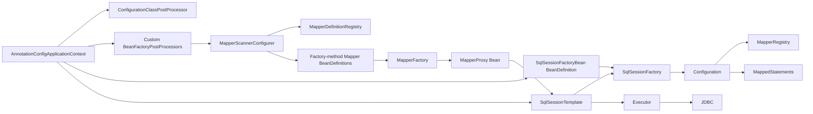
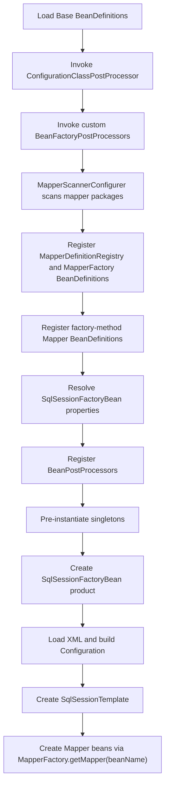
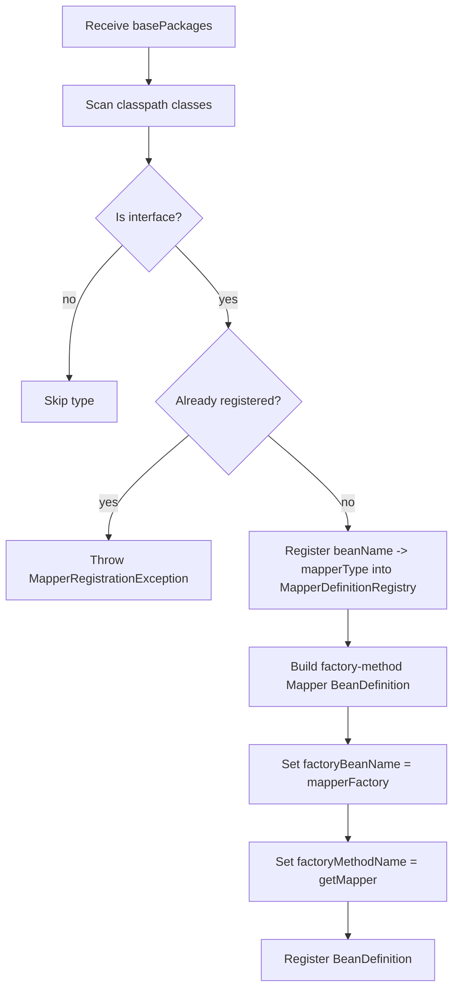
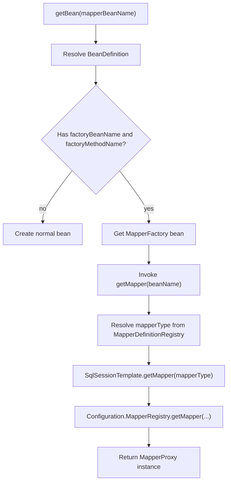
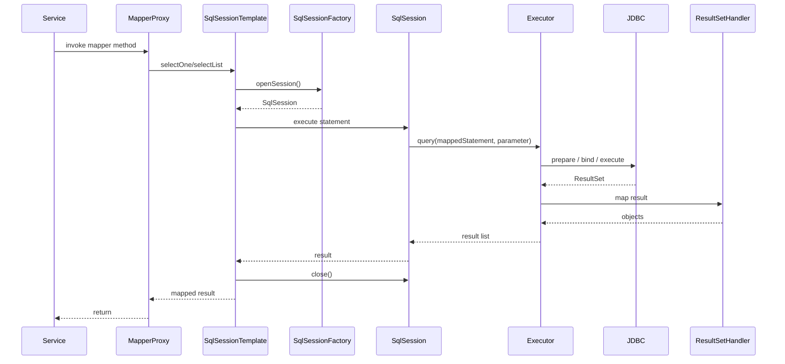
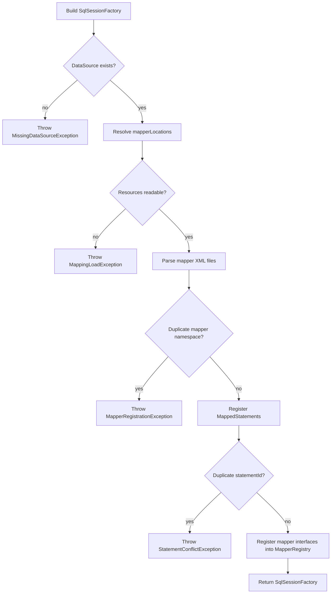

# 1. 背景与目标

## 集成目标与非目标（Non-goals）

### 集成目标
- 让 `Mapper` 接口能在 mini-spring `refresh` 期间被扫描、注册并作为 Bean 获取，最终实例为 `MapperProxy`。
- 让 `SqlSessionFactory`、`SqlSessionTemplate`、`Configuration` 由容器托管，并在启动阶段完成 XML 映射加载。
- 让 mini-mybatis 的 `MapperRegistry`、`MappedStatement` 注册过程与 mini-spring 生命周期严格对齐。
- 让集成逻辑优先通过 mini-spring 扩展点完成，不在 BeanFactory 主创建路径中增加 MyBatis 专用硬编码分支。
- 为后续事务协同、JavaConfig、插件扩展保留清晰边界。

### 非目标
- 不实现连接池。
- 不实现完整事务管理，只定义连接与会话生命周期边界。
- 不实现 XML 热更新监听。
- 不实现完整 `FactoryBean` SPI 仿真，只落当前 mini-spring 可承载的等价模型。
- 不在本阶段实现注解 SQL 映射。

## 术语表
| 术语 | 定义 |
| --- | --- |
| `MapperScanner` | 扫描指定包中的 Mapper 接口，并生成对应的 BeanDefinition 注册请求 |
| `MapperScannerConfigurer` | mini-spring `BeanFactoryPostProcessor`，在 `refresh` 阶段执行 Mapper 扫描与注册 |
| `MapperFactory` | 基础设施工厂 Bean，基于 mapper 接口类型返回 `MapperProxy`，是当前 mini-spring 下 `FactoryBean` 的等价实现 |
| `MapperDefinitionRegistry` | integration 层的 mapper 元数据注册中心，保存 BeanName 到 mapper 接口的映射 |
| `SqlSessionFactoryBean` | 负责构建 `Configuration`、解析 XML、产出 `SqlSessionFactory` 的工厂 Bean |
| `SqlSessionTemplate` | 线程安全门面，屏蔽 `SqlSession` 获取、关闭与异常边界 |
| `MapperProxy` | mini-mybatis 的 JDK 动态代理实现 |
| `Configuration` | mini-mybatis 全局配置中心，保存 `DataSource`、`MappedStatement`、`MapperRegistry` |
| `BeanFactoryPostProcessor` | mini-spring 容器扩展点，用于在单例实例化前补充或修正 BeanDefinition |
| `Factory-method BeanDefinition` | 当前 mini-spring 已支持的工厂模型，通过 `factoryBeanName + factoryMethodName` 产出最终 Bean |

## com.xujn 包结构建议（integration 模块与依赖关系）
```text
com.xujn
├── minimybatis
│   ├── binding
│   ├── builder
│   ├── executor
│   ├── mapping
│   ├── reflection
│   └── session
├── minispring
│   ├── beans
│   ├── context
│   ├── aop
│   └── core
└── minispring.integration.mybatis
    ├── annotation
    │   └── MapperScan
    ├── scanner
    │   ├── MapperScanner
    │   ├── ClassPathMapperScanner
    │   └── MapperScannerConfigurer
    ├── factory
    │   ├── MapperFactory
    │   ├── SqlSessionFactoryBean
    │   └── MapperBeanDefinitionFactory
    ├── support
    │   ├── SqlSessionTemplate
    │   ├── MapperDefinitionRegistry
    │   ├── MapperBeanNameGenerator
    │   └── ResourcePatternResolver
    ├── config
    │   ├── MybatisProperties
    │   └── MybatisConfigurationLoader
    └── exception
        ├── MapperRegistrationException
        ├── MappingLoadException
        ├── StatementConflictException
        └── MissingDataSourceException
```

- `minispring.integration.mybatis -> minispring`
  - 目的：复用 BeanDefinition、扫描器、`BeanFactoryPostProcessor`、`BeanPostProcessor`、AOP 扩展。
  - 最小实现要点：只依赖现有容器 SPI 和补充后的最小 SPI。
  - 边界：不反向侵入 mini-mybatis 执行链。
  - 可选增强：JavaConfig Import。
  - 依赖关系：`integration -> mini-spring`
- `minispring.integration.mybatis -> minimybatis`
  - 目的：复用 `Configuration`、`MapperRegistry`、`SqlSessionFactory`、`MapperProxy`。
  - 最小实现要点：只通过公开配置和会话接口接入。
  - 边界：不绕过 `Configuration` 直接写 `MappedStatement`。
  - 可选增强：事务同步适配器。
  - 依赖关系：`integration -> mini-mybatis`

# 2. 集成能力清单（必须/可选/不做）

## 必须
| 能力 | 目的 | 最小实现要点 | 边界（支持/不支持） | 可选增强 | 依赖关系 |
| --- | --- | --- | --- | --- | --- |
| Mapper 扫描注册 | 让 Mapper 接口在启动期进入 BeanDefinition 注册表 | 使用 `MapperScannerConfigurer` 作为自定义 `BeanFactoryPostProcessor` 扫描接口并注册工厂方法型 BeanDefinition | 支持接口；不支持普通类 | 注解过滤 | `integration -> mini-spring BFPP/registry`；`integration -> mini-mybatis MapperRegistry` |
| `SqlSessionFactory` 托管 | 统一构建持久层入口 | 由 `SqlSessionFactoryBean` 装配 `DataSource`、XML、`Configuration` | 单数据源；不支持环境切换 | 多数据源引用 | `integration -> mini-spring factory-method`；`integration -> mini-mybatis Configuration` |
| `Configuration` 初始化 | 启动期加载 XML 并注册 Mapper | 解析 `mapperLocations`，注册 `MappedStatement`、Mapper 接口、冲突校验 | 支持 XML；不支持注解 SQL | JavaConfig 配置桥接 | `integration -> mini-mybatis builder`；`integration -> mini-spring resource resolve` |
| Mapper 代理 Bean 化 | `getBean(mapper)` 返回代理对象 | 使用 `MapperFactory#getMapper(beanName)` 等价承载 `FactoryBean` 语义 | 支持单例；不支持 prototype | 延迟创建 | `integration -> mini-spring factory-method`；`integration -> mini-mybatis MapperProxy` |
| refresh 生命周期对齐 | 确保注册、初始化、实例化顺序稳定 | 先执行内置配置类处理器，再执行自定义 BFPP，再单例预实例化 | 不支持运行期增量注册 | 热加载刷新入口 | `integration -> mini-spring refresh` |
| DataSource/Connection 边界 | 明确资源责任 | 容器只注入 `DataSource`；`SqlSessionTemplate` 负责会话关闭；mini-mybatis Executor 负责 JDBC 资源释放 | 不实现连接池；不实现事务绑定 | 事务同步连接持有者 | `integration -> mini-spring bean wiring`；`integration -> mini-mybatis session/executor` |

## 可选
| 能力 | 目的 | 最小实现要点 | 边界（支持/不支持） | 可选增强 | 依赖关系 |
| --- | --- | --- | --- | --- | --- |
| XML 映射热加载 | 缩短调试回路 | 显式重新解析 XML 并刷新 `Configuration` | 不自动监听文件 | 文件监听 | `integration -> mini-spring events`；`integration -> mini-mybatis Configuration` |
| 事务协同 | 同线程共享连接 | 预留 `SqlSessionContext` / `ConnectionHolder` 契约 | 当前不提交/回滚 | 声明式事务 | `integration -> mini-spring tx`；`integration -> mini-mybatis Executor` |
| 插件扩展 | 为执行链预留拦截装配入口 | 只定义配置注入点 | 当前不执行插件链 | Executor/Statement 拦截器 | `integration -> mini-mybatis executor` |
| JavaConfig 配置入口 | 通过配置类声明集成 | 定义 `@MapperScan` 和 registrar 契约 | 当前文档只定义入口 | 完整 Import 机制 | `integration -> mini-spring annotation config` |

## 不做
| 能力 | 目的 | 最小实现要点 | 边界（支持/不支持） | 可选增强 | 依赖关系 |
| --- | --- | --- | --- | --- | --- |
| 连接池实现 | 管理连接复用 | 当前不实现 | 只依赖外部 `DataSource` | 接入第三方连接池 | `integration -> external DataSource` |
| 完整事务管理 | 传播、提交、回滚 | 当前只保留接口边界 | 不支持传播规则 | 后续对接 mini-spring tx 模块 | `integration -> mini-spring tx` |
| 容器主流程硬编码 MyBatis 分支 | 在 BeanFactory 中写 Mapper 专用逻辑 | 当前不采用 | 保持容器通用性 | 无 | `integration -> mini-spring SPI only` |

# 3. 总体架构与依赖关系

## 总体架构图
**标题：mini-mybatis 与 mini-spring 集成总体架构图**  
**覆盖范围说明：展示 integration 模块如何基于当前 mini-spring SPI 完成 Mapper Bean 化与持久层装配。**



## 依赖方向
- `com.xujn.minispring.integration.mybatis.scanner -> com.xujn.minispring.beans / context`
- `com.xujn.minispring.integration.mybatis.factory -> com.xujn.minispring.beans.factory.config.BeanDefinition`
- `com.xujn.minispring.integration.mybatis.factory -> com.xujn.minimybatis.session / builder / binding`
- `com.xujn.minispring.integration.mybatis.support -> com.xujn.minimybatis.session`
- `com.xujn.minispring.integration.mybatis.exception -> integration internal only`
- mini-spring 与 mini-mybatis 仍保持单向依赖，由 integration 模块收敛。

## 当前 mini-spring 现状与前置改造
- 已有能力
  - `BeanFactoryPostProcessor`
  - `BeanPostProcessor`
  - `AnnotationScan`
  - `@Configuration` 配置类处理
  - `factoryBeanName + factoryMethodName` BeanDefinition 模型
- 缺失能力
  - 原生 `FactoryBean` SPI
  - `BeanDefinitionRegistryPostProcessor`
  - 通用 BeanDefinition 属性注入
  - 接口类型的直接扫描注册
  - 工厂方法字面量参数传递能力（Phase 1 实现时需补齐）

> [注释] 当前集成必须先补最小容器 SPI，否则文档中的集成组件无法工程落地
> - 背景：现有 mini-spring 只能执行内置 `ConfigurationClassPostProcessor`，不会自动执行用户自定义 `BeanFactoryPostProcessor`；同时也没有原生 `FactoryBean`，工厂方法也不能直接接收字面量参数。
> - 影响：如果不先补最小 SPI，`MapperScannerConfigurer` 无法在 `refresh` 中生效，Mapper Bean 也无法用稳定方式产出。
> - 取舍：Phase 1 先补三个最小点：执行自定义 BFPP、支持工厂方法字面量参数、使用工厂方法型 BeanDefinition 作为 `FactoryBean` 等价模型；不引入完整 Spring 级别 SPI 复制。
> - 可选增强：后续可把等价模型升级成原生 `FactoryBean` 与 `BeanDefinitionRegistryPostProcessor`。

## refresh 生命周期对齐
> [注释] 集成逻辑必须嵌入 refresh 扩展阶段，而不是散落在 BeanFactory 主流程
> - 背景：Mapper 扫描和 `SqlSessionFactory` 初始化都依赖明确的启动顺序。
> - 影响：必须先执行内置配置处理，再执行自定义 BFPP，最后再做单例预实例化。
> - 取舍：不在 `createBean` 内为 Mapper 单独加分支；通过工厂方法 BeanDefinition 和基础设施 Bean 完成装配。
> - 可选增强：后续用 JavaConfig registrar 在更早阶段注入扫描配置。

- `refresh` 阶段顺序建议
  1. 读取基础 BeanDefinition。
  2. 执行内置 `ConfigurationClassPostProcessor`。
  3. 发现并执行自定义 `BeanFactoryPostProcessor`。
  4. `MapperScannerConfigurer` 扫描接口并注册 `MapperDefinitionRegistry`、`MapperFactory`、Mapper BeanDefinitions。
  5. 解析 `mapperLocations`、校验 `SqlSessionFactoryBean` 依赖。
  6. 注册 `BeanPostProcessor`。
  7. 预实例化单例。
  8. 创建 `SqlSessionFactoryBean` 产品对象，完成 `Configuration` 与 XML 初始化。
  9. 创建 `SqlSessionTemplate`。
  10. 通过 `MapperFactory` 工厂方法创建 Mapper 代理 Bean。

# 4. 关键模块与包结构（com.xujn）

## 建议包结构
```text
com.xujn.minispring.integration.mybatis
├── annotation
│   └── MapperScan
├── scanner
│   ├── MapperScanner
│   ├── ClassPathMapperScanner
│   └── MapperScannerConfigurer
├── factory
│   ├── MapperFactory
│   ├── SqlSessionFactoryBean
│   └── MapperBeanDefinitionFactory
├── support
│   ├── SqlSessionTemplate
│   ├── MapperDefinitionRegistry
│   ├── MapperBeanNameGenerator
│   └── ResourcePatternResolver
├── config
│   ├── MybatisProperties
│   └── MybatisConfigurationLoader
└── exception
    ├── MapperRegistrationException
    ├── MappingLoadException
    ├── StatementConflictException
    └── MissingDataSourceException
```

## 包职责与边界

### `com.xujn.minispring.integration.mybatis.annotation`
- 目的：为后续 JavaConfig 提供声明式入口。
- 最小实现要点：定义 `@MapperScan` 契约。
- 边界：Phase 1 不执行 JavaConfig 导入。
- 可选增强：支持 `sqlSessionFactoryRef`、过滤器。
- 依赖关系：`integration -> mini-spring annotation metadata`

### `com.xujn.minispring.integration.mybatis.scanner`
- 目的：发现 Mapper 接口并注册 BeanDefinition。
- 最小实现要点：按包扫描接口，调用 `MapperBeanDefinitionFactory` 产出工厂方法型定义。
- 边界：不加载 XML，不直接创建代理实例。
- 可选增强：注解过滤、命名规则。
- 依赖关系：`integration -> mini-spring registry/BFPP`；`integration -> mini-mybatis binding metadata`

### `com.xujn.minispring.integration.mybatis.factory`
- 目的：承载工厂语义，把容器创建桥接到 mybatis 运行时对象。
- 最小实现要点：`SqlSessionFactoryBean` 构建工厂；`MapperFactory` 产出代理；`MapperBeanDefinitionFactory` 负责定义生成。
- 边界：不承担事务提交，不承担 AOP。
- 可选增强：延迟初始化、多工厂引用。
- 依赖关系：`integration -> mini-spring factory-method bean definition`；`integration -> mini-mybatis session/configuration`

### `com.xujn.minispring.integration.mybatis.support`
- 目的：提供模板门面、资源解析和 mapper 元数据注册。
- 最小实现要点：`SqlSessionTemplate` 管理会话边界；`MapperDefinitionRegistry` 保存 BeanName 与 mapper 接口映射。
- 边界：不直接执行扫描。
- 可选增强：事务同步、资源缓存。
- 依赖关系：`integration -> mini-mybatis session/executor`；`integration -> mini-spring resource abstraction`

### `com.xujn.minimybatis.*`
- 目的：复用持久层核心执行链和配置模型。
- 最小实现要点：暴露 `Configuration`、`SqlSessionFactory`、`MapperRegistry`、`MapperProxy`。
- 边界：不依赖容器 API。
- 可选增强：插件、事务接口。
- 依赖关系：被 `integration` 依赖

### `com.xujn.minispring.*`
- 目的：提供容器扩展点与生命周期基础设施。
- 最小实现要点：支持扫描、BeanDefinition、BFPP、BPP、AOP、工厂方法实例化。
- 边界：当前不直接理解 Mapper 接口与 XML。
- 可选增强：原生 `FactoryBean`、`BeanDefinitionRegistryPostProcessor`。
- 依赖关系：被 `integration` 依赖

# 5. 核心数据结构与接口草图

## MapperScanner 接口草图
- 目的：统一 Mapper 扫描输入与 BeanDefinition 输出。
- 最小实现要点：接收包路径，返回待注册 mapper 元数据与 BeanDefinition 列表。
- 边界：只处理发现与定义生成，不创建代理。
- 可选增强：注解过滤、排除规则。
- 依赖关系：`integration -> mini-spring scanning`

```java
public interface MapperScanner {
    Set<Class<?>> scan(String... basePackages);
    boolean isCandidateComponent(Class<?> beanClass);
}
```

## MapperFactory 等价工厂接口草图
- 目的：在当前 mini-spring 下替代原生 `FactoryBean` 语义。
- 最小实现要点：根据 BeanName 找到 mapper 接口，再通过 `SqlSessionTemplate` 返回代理。
- 边界：不暴露 `SqlSession` 给业务层。
- 可选增强：延迟创建、原型模式。
- 依赖关系：`integration -> mini-spring factory-method`；`integration -> mini-mybatis MapperRegistry`

```java
public class MapperFactory {
    public void setMapperDefinitionRegistry(MapperDefinitionRegistry registry);
    public void setSqlSessionTemplate(SqlSessionTemplate sqlSessionTemplate);
    public Object getMapper(String beanName);
}
```

## MapperDefinitionRegistry 字段列表
- 目的：弥补当前 mini-spring 缺少通用 BeanDefinition 属性注入的问题。
- 最小实现要点：
  - `Map<String, Class<?>> mapperTypesByBeanName`
  - `Map<Class<?>, String> beanNamesByMapperType`
- 边界：
  - 只保存 mapper 元数据
  - 不保存 `SqlSession` 或连接状态
- 可选增强：
  - 按 `sqlSessionFactoryRef` 分组
  - 冲突诊断报告
- 依赖关系：`integration -> mini-spring registry`；`integration -> mini-mybatis mapper metadata`

```java
public class MapperDefinitionRegistry {
    private Map<String, Class<?>> mapperTypesByBeanName;
    private Map<Class<?>, String> beanNamesByMapperType;
}
```

## SqlSessionFactoryBean 字段列表
- 目的：统一承接容器配置并组装 `SqlSessionFactory`。
- 最小实现要点：
  - `DataSource dataSource`
  - `String configLocation`
  - `String[] mapperLocations`
  - `String[] typeAliasesPackages`
  - `Properties configurationProperties`
  - `boolean failFast`
  - `ConflictPolicy conflictPolicy`
- 边界：
  - 支持 XML 资源路径
  - 不支持多数据源聚合
- 可选增强：
  - 插件列表
  - 对象工厂
  - 事务工厂
- 依赖关系：`integration -> mini-spring bean wiring`；`integration -> mini-mybatis Configuration`

```java
public class SqlSessionFactoryBean {
    private DataSource dataSource;
    private String configLocation;
    private String[] mapperLocations;
    private String[] typeAliasesPackages;
    private Properties configurationProperties;
    private boolean failFast;
    private ConflictPolicy conflictPolicy;

    public SqlSessionFactory buildSqlSessionFactory();
}
```

## SqlSessionTemplate 接口草图
- 目的：为业务层和 Mapper 工厂提供线程安全调用门面。
- 最小实现要点：封装查询、更新、获取 Mapper。
- 边界：不暴露底层连接。
- 可选增强：事务同步会话复用。
- 依赖关系：`integration -> mini-mybatis SqlSessionFactory`

```java
public interface SqlSessionTemplate {
    <T> T selectOne(String statement);
    <T> T selectOne(String statement, Object parameter);
    <E> List<E> selectList(String statement);
    <E> List<E> selectList(String statement, Object parameter);
    int update(String statement, Object parameter);
    <T> T getMapper(Class<T> mapperType);
}
```

## 冲突与错误模型
- 目的：让启动失败和运行失败具备可定位的错误输出。
- 最小实现要点：
  - 异常类型独立
  - 错误信息包含 `mapperClass`、`statementId`、`resourcePath`
  - 默认 `FAIL_FAST`
- 边界：
  - 启动期冲突直接中止 `refresh`
  - 运行期缺失语句直接抛框架异常
- 可选增强：
  - 错误码
  - 结构化诊断对象
- 依赖关系：`integration -> mini-spring refresh exception path`；`integration -> mini-mybatis mapping metadata`

| 异常类型 | 触发场景 | 错误信息要求 |
| --- | --- | --- |
| `MissingDataSourceException` | `SqlSessionFactoryBean` 初始化时未解析到 `DataSource` | 必须包含 beanName 与依赖引用名 |
| `MappingLoadException` | XML 资源不存在、不可读、格式错误 | 必须包含资源路径与 mapper namespace |
| `StatementConflictException` | 同一 `statementId` 重复注册 | 必须包含 `statementId`、旧资源路径、新资源路径 |
| `MapperRegistrationException` | Mapper 接口重复注册、接口不合法或 beanName 冲突 | 必须包含 `mapperClass` 与扫描来源包 |
| `MapperBindingException` | Mapper 方法找不到映射语句 | 必须包含 `mapperClass`、`methodName`、`statementId` |

# 6. 核心流程（必须包含至少 5 张 Mermaid）

## 图 1：refresh 集成总流程图
**标题：mini-spring refresh 与 mybatis 集成总流程**  
**覆盖范围说明：展示当前 mini-spring 下内置配置处理、自定义 BFPP、单例预实例化与 Mapper 代理创建的顺序。**



> [注释] 生命周期顺序必须与当前 mini-spring 的真实 refresh 行为对齐
> - 背景：当前容器先执行内置 `ConfigurationClassPostProcessor`，随后才有机会执行用户自定义 BFPP。
> - 影响：Mapper 扫描不能假定存在 `BeanDefinitionRegistryPostProcessor`，必须放入自定义 BFPP 执行序列中。
> - 取舍：先补自定义 BFPP 执行能力，再在 BFPP 中完成扫描注册。
> - 可选增强：后续增加真正的 `BeanDefinitionRegistryPostProcessor` 后，可把扫描逻辑前移。

## 图 2：MapperScanner -> BeanDefinition 注册流程图
**标题：MapperScanner BeanDefinition 注册流程**  
**覆盖范围说明：展示接口扫描、冲突检查、mapper 元数据注册和工厂方法型 BeanDefinition 生成。**



> [注释] Mapper 扫描与 BeanDefinition 注册时机决定了后续 `getBean(mapper)` 是否可用
> - 背景：当前 mini-spring 默认扫描器只注册 `@Component` 具体类，不会处理接口。
> - 影响：integration 必须单独扫描接口，并在 BFPP 阶段手工把 Mapper 定义写入注册表。
> - 取舍：采用包扫描 + 接口过滤，不要求 `@Mapper` 注解。
> - 可选增强：增加 `ANNOTATION` 模式和 include/exclude 过滤器。

## 图 3：getBean(mapper) 创建流程（等价工厂方法分支）
**标题：Mapper Bean 创建的工厂方法分支流程**  
**覆盖范围说明：展示容器如何通过 `factoryBeanName + factoryMethodName` 生成 Mapper 代理 Bean。**



> [注释] 当前 mini-spring 没有原生 `FactoryBean`，所以 Mapper Bean 必须使用等价工厂方法模型
> - 背景：文档语义上仍是“工厂产物 Bean”，但实现承载点不是 `FactoryBean#getObject()`，而是工厂方法 BeanDefinition。
> - 影响：Mapper 接口元数据不能依赖普通属性注入，必须放进 `MapperDefinitionRegistry` 由工厂读取。
> - 取舍：保持设计语义接近 Spring MyBatis 集成，但实现对齐当前 mini-spring 能力。
> - 可选增强：后续补原生 `FactoryBean` SPI 后，可把 `MapperFactory` 收敛到 `MapperFactoryBean`。

## 图 4：SqlSessionTemplate 调用链时序图
**标题：SqlSessionTemplate 到 JDBC 的调用时序**  
**覆盖范围说明：展示模板门面、会话工厂、执行器和映射链路的运行时顺序。**



> [注释] DataSource 与 Connection 的管理边界必须由模板层和执行层共同保证
> - 背景：容器只负责注入 `DataSource`，运行期连接开启和释放仍在 mini-mybatis 执行链。
> - 影响：`SqlSessionTemplate` 负责会话边界；mini-mybatis Executor 负责 JDBC 资源关闭；异常路径也必须关闭。
> - 取舍：无事务场景下每次模板调用独立打开并关闭 `SqlSession`。
> - 可选增强：事务同步后，由模板先查询线程绑定会话再决定是否关闭。

## 图 5：资源加载与失败处理流程图
**标题：XML 映射加载与冲突失败处理流程**  
**覆盖范围说明：展示 `SqlSessionFactoryBean` 初始化阶段的资源解析、映射注册与 fail-fast 错误路径。**



> [注释] 映射加载失败、重复 mapper、重复 statementId 必须在启动期暴露
> - 背景：这些问题属于配置错误，延迟到首个查询请求只会扩大故障半径。
> - 影响：`SqlSessionFactoryBean` 必须在初始化阶段完成 XML 解析、注册和冲突校验。
> - 取舍：默认 `FAIL_FAST`，不提供静默覆盖。
> - 可选增强：开发模式输出冲突汇总报告。

## AOP 叠加代理说明
> [注释] Mapper 代理允许再被 AOP 代理，但 AOP 应包裹容器 Bean，不应替换 mybatis 内部代理模型
> - 背景：mini-spring 已有 BPP/AOP 扩展点，Mapper Bean 进入容器后仍可能被日志、监控、事务切面增强。
> - 影响：AOP 代理外层包裹 `MapperFactory` 产物即可；`MapperProxy` 内部调用链保持不变。
> - 取舍：允许二次代理，禁止切面直接改写 `Configuration`、`MapperRegistry`。
> - 可选增强：识别 Mapper Bean 并跳过重复接口代理优化。

# 7. 关键设计取舍与边界

## Mapper Bean 的创建策略：FactoryBean 语义 vs 等价工厂方法模型
> [注释] 设计语义保持“工厂产物 Bean”，实现模型使用当前 mini-spring 可支持的工厂方法 BeanDefinition
> - 背景：完整 `FactoryBean` 是理想模型，但当前 mini-spring 尚未提供该 SPI。
> - 影响：Mapper Bean 不能直接写成接口类型实例化，也不能依赖 `getObject()` 协议。
> - 取舍：Phase 1 选择“等价工厂方法模型”，由 `MapperFactory` 统一产出代理。
> - 可选增强：后续升级到原生 `FactoryBean` 时，业务获取方式保持不变。

- 目的：降低对容器核心流程的侵入，同时对齐当前实现现实。
- 最小实现要点：所有 Mapper BeanDefinition 使用 `factoryBeanName + factoryMethodName` 指向 `MapperFactory#getMapper(beanName)`。
- 最小实现要点补充：Mapper BeanDefinition 需要携带字面量 `factoryMethodArguments = {beanName}`，用于把 beanName 传入 `MapperFactory`。
- 边界：
  - 支持单例代理
  - 不支持 prototype Mapper
- 可选增强：
  - 原生 `FactoryBean`
  - `InstanceSupplier`
- 依赖关系：`integration -> mini-spring factory-method`；`integration -> mini-mybatis MapperRegistry`

## 扫描策略：按包扫描 + 接口过滤规则
- 目的：把 Mapper 发现约束在稳定、可预期的类型集合。
- 最小实现要点：
  - 输入 `basePackages`
  - 只接收接口
  - 默认不过滤注解
  - Bean 名称由 `MapperBeanNameGenerator` 统一生成
- 边界：
  - 默认 `PACKAGE`
  - 不要求 `@Mapper` 注解
- 可选增强：
  - `ANNOTATION` 模式
  - include/exclude 过滤器
- 依赖关系：`integration -> mini-spring classpath scanning`

## SqlSession 生命周期：每次调用获取连接 vs 绑定线程
- 目的：先保证资源释放正确，再为事务协同预留接口。
- 最小实现要点：
  - `SqlSessionTemplate` 每次调用创建 `SqlSession`
  - 无事务时执行后立即关闭
  - 连接不跨调用缓存
- 边界：
  - 当前不做线程绑定会话
  - 当前不做事务传播
- 可选增强：
  - 事务上下文会话复用
  - 手动会话控制
- 依赖关系：`integration -> mini-mybatis SqlSessionFactory/Executor`

## 与 AOP 的交互：MapperProxy 是否允许再被代理
- 目的：保证持久层 Bean 能与容器切面能力协同。
- 最小实现要点：
  - 允许 AOP 包裹 Mapper Bean
  - AOP 代理位于 `MapperProxy` 外层
  - 不改变 `MapperFactory` 的单例语义
- 边界：
  - 不支持 AOP 替换内部 `SqlSessionTemplate`
  - 不支持切面动态改写 `MappedStatement`
- 可选增强：
  - 特定 Advisor 跳过 Mapper Bean
  - SQL 执行耗时监控
- 依赖关系：`integration -> mini-spring AOP`

## 失败策略：缺失映射、重复 statementId、mapper 冲突、DataSource 缺失
- 目的：把配置错误前移到启动期。
- 最小实现要点：
  - `DataSource` 缺失：`SqlSessionFactoryBean` 初始化失败
  - XML 资源缺失：`MappingLoadException`
  - Mapper 冲突：`MapperRegistrationException`
  - `statementId` 冲突：`StatementConflictException`
  - Mapper 方法缺失语句：`MapperBindingException`
- 边界：
  - 默认 `FAIL_FAST`
  - 不支持静默覆盖
- 可选增强：
  - `OVERRIDE` 仅用于显式配置
  - 启动诊断报告
- 依赖关系：`integration -> mini-spring refresh abort path`；`integration -> mini-mybatis Configuration`

# 8. 开发迭代计划（Git 驱动）

## Phase 1：MapperScanner + 等价工厂模型 + SqlSessionFactoryBean
- 目标：让 Mapper 作为 Bean 成功注册、注入并可触发 mini-mybatis 查询闭环。
- 范围：
  - mini-spring：执行自定义 `BeanFactoryPostProcessor`
  - integration：`MapperScannerConfigurer`、`MapperDefinitionRegistry`、`MapperFactory`
  - integration：`SqlSessionFactoryBean`、`SqlSessionTemplate`
  - mini-mybatis：必要的 `MapperRegistry` 接入口
- 交付物：
  - Mapper 扫描与注册链路
  - `SqlSessionFactory` Bean 托管
  - 启动期 fail-fast 冲突校验
- 验收标准（可量化）：
  - 指定包下 Mapper 接口 100% 注册为工厂方法型 BeanDefinition
  - `getBean(mapper)` 返回代理对象
  - 启动阶段能完成 XML 加载并注册 statement
  - `DataSource` 缺失时容器启动失败
- 风险与缓解：
  - 风险：mini-spring 不执行自定义 BFPP
  - 缓解：先补 `AnnotationConfigApplicationContext` 的 BFPP 执行链

## Phase 2：SqlSessionTemplate + 资源加载增强 + 错误模型完善
- 目标：补齐线程安全门面、错误模型与资源解析链路。
- 范围：
  - `SqlSessionTemplate`
  - `ResourcePatternResolver`
  - XML 资源批量解析
  - 异常模型与错误信息规范
- 交付物：
  - 模板调用门面
  - 启动期资源解析器
  - 失败路径测试
- 验收标准（可量化）：
  - 所有 Mapper 调用统一经过 `SqlSessionTemplate`
  - XML 资源不可读时抛出带资源路径的异常
  - 重复 `statementId` 错误同时包含旧资源与新资源
  - 查询异常路径中连接、语句、结果集关闭率为 100%
- 风险与缓解：
  - 风险：模板层和执行层关闭职责重叠
  - 缓解：模板只关闭 `SqlSession`，JDBC 资源仍由 mini-mybatis Executor 关闭

## Phase 3：JavaConfig 配置入口协同 + 事务边界预留
- 目标：让集成入口不只依赖扫描配置，并为事务协同预留接入点。
- 范围：
  - `@MapperScan`
  - `MybatisIntegrationRegistrar`
  - 事务同步接口
  - AOP 协同校验
- 交付物：
  - JavaConfig 接入文档
  - 事务边界设计
  - AOP 兼容策略
- 验收标准（可量化）：
  - JavaConfig 能驱动 Mapper 扫描
  - 事务接口引入后不修改 Phase 1 BeanDefinition 模型
  - Mapper Bean 经过 AOP 后仍可查询
  - Phase 1/2 用例全部回归通过
- 风险与缓解：
  - 风险：JavaConfig 导入与扫描重复注册 Mapper
  - 缓解：统一通过 `MapperDefinitionRegistry` 与 BeanDefinition 注册表双重去重

> [注释] 事务边界预留应建立在既有模板和工厂模型之上，不重新设计 Mapper Bean 创建路径
> - 背景：一旦事务协同引入新的会话获取方式，最容易破坏的是 `SqlSessionTemplate` 和 Mapper 工厂契约。
> - 影响：Phase 3 只允许扩展模板内部会话获取策略，不允许改动 Mapper BeanDefinition 结构。
> - 取舍：把事务演进约束在 support 层与会话工厂适配层。
> - 可选增强：提供 `TransactionalSqlSessionTemplate` 包装器，而不是替换已有 Mapper 工厂。

# 9. Git 规范（Angular Conventional Commits）

## commit message 格式
- 格式：`type(scope): subject`
- 规则：
  - `type` 使用 Angular Conventional Commits
  - `scope` 对应模块，例如 `spring-context`、`scanner`、`factory`、`support`、`integration-docs`
  - `subject` 使用英文动词短语，描述单一变更意图

## type 列表与适用场景
- `feat`：新增扫描器、工厂、模板、配置入口
- `fix`：修复注册时序、资源定位、冲突判断、关闭逻辑
- `refactor`：调整包结构、提炼抽象、不改变外部行为
- `docs`：补充架构文档、阶段文档、验收说明
- `test`：增加集成验收、失败路径、资源释放校验
- `chore`：脚手架、示例资源、构建元数据

## 示例：每个 phase 至少 3 条示例提交

### Phase 1 示例提交
1. `feat(spring-context): invoke custom bean factory post processors during refresh`  
   文件路径：`/Users/xjn/Develop/projects/java/mini-spring/src/main/java/com/xujn/minispring/context/support/AnnotationConfigApplicationContext.java`
2. `feat(scanner): register mapper factory-method bean definitions from base packages`  
   文件路径：`/Users/xjn/Develop/projects/java/mini-mybatis/src/main/java/com/xujn/minispring/integration/mybatis/scanner/MapperScannerConfigurer.java`  
   文件路径：`/Users/xjn/Develop/projects/java/mini-mybatis/src/main/java/com/xujn/minispring/integration/mybatis/support/MapperDefinitionRegistry.java`
3. `feat(factory): add sql session factory bean and mapper factory bootstrap`  
   文件路径：`/Users/xjn/Develop/projects/java/mini-mybatis/src/main/java/com/xujn/minispring/integration/mybatis/factory/SqlSessionFactoryBean.java`  
   文件路径：`/Users/xjn/Develop/projects/java/mini-mybatis/src/main/java/com/xujn/minispring/integration/mybatis/factory/MapperFactory.java`

### Phase 2 示例提交
1. `feat(support): add sql session template as thread-safe facade`  
   文件路径：`/Users/xjn/Develop/projects/java/mini-mybatis/src/main/java/com/xujn/minispring/integration/mybatis/support/SqlSessionTemplate.java`
2. `feat(exception): add fail-fast mapping conflict exceptions`  
   文件路径：`/Users/xjn/Develop/projects/java/mini-mybatis/src/main/java/com/xujn/minispring/integration/mybatis/exception/StatementConflictException.java`  
   文件路径：`/Users/xjn/Develop/projects/java/mini-mybatis/src/main/java/com/xujn/minispring/integration/mybatis/exception/MappingLoadException.java`
3. `test(integration): cover resource loading and datasource missing failures`  
   文件路径：`/Users/xjn/Develop/projects/java/mini-mybatis/src/test/java/com/xujn/minispring/integration/mybatis/IntegrationBootstrapTest.java`

### Phase 3 示例提交
1. `feat(annotation): add mapper scan annotation entry for javaconfig integration`  
   文件路径：`/Users/xjn/Develop/projects/java/mini-mybatis/src/main/java/com/xujn/minispring/integration/mybatis/annotation/MapperScan.java`  
   文件路径：`/Users/xjn/Develop/projects/java/mini-mybatis/src/main/java/com/xujn/minispring/integration/mybatis/support/MybatisIntegrationRegistrar.java`
2. `refactor(support): extract session holder contract for transaction integration`  
   文件路径：`/Users/xjn/Develop/projects/java/mini-mybatis/src/main/java/com/xujn/minispring/integration/mybatis/support/SqlSessionContext.java`  
   文件路径：`/Users/xjn/Develop/projects/java/mini-mybatis/src/main/java/com/xujn/minispring/integration/mybatis/support/SqlSessionTemplate.java`
3. `docs(integration-docs): align integration design with current mini-spring spi`  
   文件路径：`/Users/xjn/Develop/projects/java/mini-mybatis/docs/integration-mybatis-spring.md`  
   文件路径：`/Users/xjn/Develop/projects/java/mini-mybatis/tests/acceptance-integration-mybatis-spring-phase-3.md`

## 分支策略与 PR 模板要点
- 分支策略
  - `main`：稳定主线
  - `feature/integration-phase-1-bootstrap`
  - `feature/integration-phase-2-template-and-errors`
  - `feature/integration-phase-3-javaconfig-and-tx-boundary`
- PR 模板要点
  - 变更目标：所属 Phase 与集成能力
  - 生命周期影响：是否影响 `refresh` 阶段顺序
  - 依赖方向：是否保持 `integration -> mini-spring & mini-mybatis`
  - 失败策略：新增或变更的 fail-fast 规则
  - 验收证据：正常路径、失败路径、资源释放验证结果
