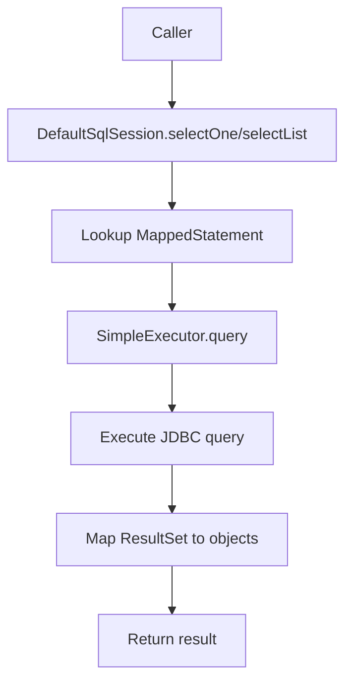
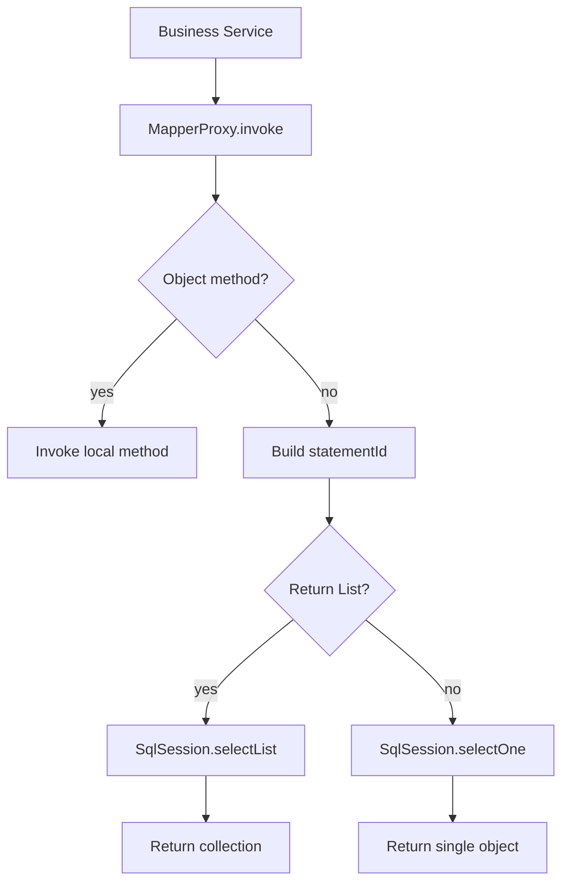

# MyBatis Phase 1: Core Query Pipeline

## 1. 目标与范围（必须/不做）

### 必须
- 打通 `SqlSession -> MapperProxy -> Executor -> JDBC` 的基础查询闭环。
- 支持 XML 映射模型，至少支持 `<mapper namespace>` 与 `<select>`。
- 支持 `Configuration`、`MappedStatement`、`SqlSessionFactory`、`DefaultSqlSession`、`MapperRegistry`、`MapperProxy`、`SimpleExecutor`。
- 支持通过 Mapper 接口执行单对象查询与列表查询。
- 启动阶段完成 XML 解析与 `statementId` 注册。
- 缺失 `MappedStatement`、重复 `statementId`、Mapper namespace 不一致时抛出明确异常。

### 不做
- `ParameterHandler`
- `ResultSetHandler` 独立节点
- 复杂多参数绑定
- 显式 `ResultMap`
- 二级缓存
- 插件体系
- 动态 SQL
- 事务管理
- mini-spring 集成逻辑

## 2. 设计与关键决策

### 包结构
```text
com.xujn.minimybatis
├── binding
│   ├── MapperProxy
│   ├── MapperProxyFactory
│   └── MapperRegistry
├── builder
│   └── xml
│       ├── XmlMapperBuilder
│       └── XmlStatementParser
├── executor
│   ├── Executor
│   └── SimpleExecutor
├── mapping
│   ├── MappedStatement
│   ├── SqlCommandType
│   └── SqlSource
├── session
│   ├── Configuration
│   ├── SqlSession
│   ├── SqlSessionFactory
│   └── defaults
│       ├── DefaultSqlSession
│       └── DefaultSqlSessionFactory
└── support
    ├── ErrorContext
    ├── ExceptionFactory
    └── JdbcUtils
```

### 核心接口草图

#### `SqlSession`
- 目的：提供查询入口与 Mapper 获取能力。
- 最小实现要点：支持 `selectOne`、`selectList`、`getMapper`。
- 边界：Phase 1 不暴露事务接口。
- 可选增强：增删改、批量执行。
- 依赖关系：`session -> executor / binding / mapping`

```java
public interface SqlSession extends AutoCloseable {
    <T> T selectOne(String statement);
    <T> T selectOne(String statement, Object parameter);
    <E> List<E> selectList(String statement);
    <E> List<E> selectList(String statement, Object parameter);
    <T> T getMapper(Class<T> type);
    Configuration getConfiguration();
    void close();
}
```

#### `Executor`
- 目的：统一编排 JDBC 查询执行。
- 最小实现要点：根据 `MappedStatement` 执行查询并返回结果列表。
- 边界：只实现简单查询。
- 可选增强：缓存执行器、批量执行器。
- 依赖关系：`executor -> mapping / session / jdbc`

```java
public interface Executor {
    <E> List<E> query(MappedStatement ms, Object parameter);
    void close(boolean forceRollback);
}
```

#### `MapperProxy`
- 目的：把 Mapper 接口方法路由到 `SqlSession`。
- 最小实现要点：基于 `namespace + methodName` 生成 `statementId`。
- 边界：不支持重载方法。
- 可选增强：`MapperMethod` 缓存。
- 依赖关系：`binding -> session / mapping`

> [注释] MapperProxy 在 Phase 1 采用“方法名直连 statementId”的最小策略
> - 背景：最小闭环要求先打通接口调用到 SQL 执行，不引入复杂方法解析缓存。
> - 影响：Mapper 接口方法名必须与 XML 中的 `id` 一致，且不支持重载。
> - 取舍：保留稳定映射关系，放弃复杂签名解析。
> - 可选增强：后续引入 `MapperMethod` 缓存返回值类型与命令类型。

### 执行链设计
- `DefaultSqlSession`
  - 目的：作为调用入口调度 `Executor`。
  - 最小实现要点：按 `statementId` 从 `Configuration` 获取 `MappedStatement`。
  - 边界：只支持查询。
  - 可选增强：更新、删除、插入。
  - 依赖关系：`session -> configuration / executor`
- `SimpleExecutor`
  - 目的：直接使用 JDBC 执行查询。
  - 最小实现要点：获取连接、创建 `PreparedStatement`、执行 SQL、读取 `ResultSet`。
  - 边界：不复用 Statement，不缓存。
  - 可选增强：拆分出 `StatementHandler`、`ResultSetHandler`。
  - 依赖关系：`executor -> DataSource / MappedStatement`
- `XmlMapperBuilder`
  - 目的：把 XML 解析为 `MappedStatement` 并注册到 `Configuration`。
  - 最小实现要点：支持 `namespace`、`id`、`resultType`、原始 SQL 文本。
  - 边界：只支持 `<select>`。
  - 可选增强：参数类型、结果映射、动态 SQL。
  - 依赖关系：`builder -> mapping / session`

### 关键注释说明块
> [注释] SQL 映射与参数绑定在 Phase 1 只支持“无参数或单参数透传”的最小模型
> - 背景：Phase 1 的目标是先跑通基础查询链，不实现完整参数占位符解析。
> - 影响：示例 SQL 需要优先覆盖无参数查询或单参数直接绑定场景。
> - 取舍：不引入独立 `ParameterHandler`，避免跨 Phase 实现。
> - 可选增强：Phase 2 再补 `BoundSql`、`ParameterMapping`、多参数封装。

> [注释] ResultMap 与对象映射在 Phase 1 采用“简单结果优先”
> - 背景：完整对象映射依赖独立结果集处理器与反射元数据。
> - 影响：Phase 1 仅覆盖简单 JavaBean 字段同名映射与简单类型首列映射。
> - 取舍：不支持嵌套对象和显式 `ResultMap`。
> - 可选增强：Phase 2 引入 `ResultSetHandler` 与下划线转驼峰。

## 3. 流程与图

### 图 1：SqlSession 到 Executor 查询流程
**标题：Phase 1 查询入口流程**  
**覆盖范围说明：展示从 `SqlSession` 发起查询到 `Executor` 返回结果的最小闭环。**



### 图 2：MapperProxy 调用流程
**标题：Phase 1 MapperProxy 调用链**  
**覆盖范围说明：展示 Mapper 接口方法如何被代理并路由到 `SqlSession`。**



## 4. 验收标准（可量化）
- XML 解析后 `Configuration` 中成功注册全部 `MappedStatement`。
- `SqlSession.getMapper` 能返回指定 Mapper 接口代理。
- 通过 Mapper 方法可执行 1 条单对象查询并返回结果。
- 通过 `SqlSession.selectList` 可执行 1 条列表查询并返回结果集合。
- `statementId` 不存在时抛出包含 `statementId` 的异常。
- XML 中重复 `statementId` 时初始化失败，错误信息包含资源路径。
- 每次查询完成后 `Connection`、`PreparedStatement`、`ResultSet` 都被关闭。

## 5. Git 交付计划
- branch: `feature/mybatis-phase-1-core-query`
- PR title: `feat(mybatis): implement phase 1 core query pipeline`
- commits（>=8 条，Angular 格式 + 文件路径）：
  - `feat(config): add configuration and mapped statement registry` -> `/Users/xjn/Develop/projects/java/mini-mybatis/src/main/java/com/xujn/minimybatis/session/Configuration.java`, `/Users/xjn/Develop/projects/java/mini-mybatis/src/main/java/com/xujn/minimybatis/mapping/MappedStatement.java`
  - `feat(session): add sql session and default sql session factory` -> `/Users/xjn/Develop/projects/java/mini-mybatis/src/main/java/com/xujn/minimybatis/session/SqlSession.java`, `/Users/xjn/Develop/projects/java/mini-mybatis/src/main/java/com/xujn/minimybatis/session/defaults/DefaultSqlSession.java`, `/Users/xjn/Develop/projects/java/mini-mybatis/src/main/java/com/xujn/minimybatis/session/defaults/DefaultSqlSessionFactory.java`
  - `feat(mapper): add mapper registry and proxy factory` -> `/Users/xjn/Develop/projects/java/mini-mybatis/src/main/java/com/xujn/minimybatis/binding/MapperRegistry.java`, `/Users/xjn/Develop/projects/java/mini-mybatis/src/main/java/com/xujn/minimybatis/binding/MapperProxy.java`, `/Users/xjn/Develop/projects/java/mini-mybatis/src/main/java/com/xujn/minimybatis/binding/MapperProxyFactory.java`
  - `feat(executor): add simple executor for direct jdbc queries` -> `/Users/xjn/Develop/projects/java/mini-mybatis/src/main/java/com/xujn/minimybatis/executor/Executor.java`, `/Users/xjn/Develop/projects/java/mini-mybatis/src/main/java/com/xujn/minimybatis/executor/SimpleExecutor.java`
  - `feat(builder): parse xml select statements into mapped statements` -> `/Users/xjn/Develop/projects/java/mini-mybatis/src/main/java/com/xujn/minimybatis/builder/xml/XmlMapperBuilder.java`, `/Users/xjn/Develop/projects/java/mini-mybatis/src/main/java/com/xujn/minimybatis/builder/xml/XmlStatementParser.java`
  - `feat(resources): add phase 1 mapper xml examples` -> `/Users/xjn/Develop/projects/java/mini-mybatis/src/main/resources/mapper/*.xml`
  - `feat(examples): add runnable h2 example for mapper query flow` -> `/Users/xjn/Develop/projects/java/mini-mybatis/examples/phase1/Phase1QueryExample.java`
  - `test(executor): verify statement missing and duplicate id failures` -> `/Users/xjn/Develop/projects/java/mini-mybatis/src/test/java/com/xujn/minimybatis/Phase1QueryTest.java`, `/Users/xjn/Develop/projects/java/mini-mybatis/src/test/resources/mapper/duplicate-mapper.xml`
  - `docs(mybatis): add phase 1 design and acceptance documents` -> `/Users/xjn/Develop/projects/java/mini-mybatis/docs/mybatis-phase-1.md`, `/Users/xjn/Develop/projects/java/mini-mybatis/tests/acceptance-mybatis-phase-1.md`
