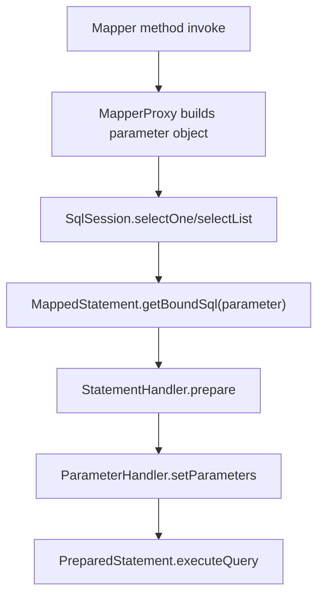
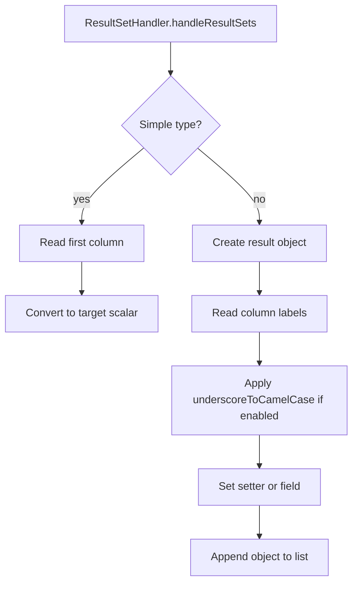

# MyBatis Phase 2: Parameter Binding And Result Mapping

## 1. 目标与范围（必须/不做）

### 必须
- 在 Phase 1 查询闭环基础上拆分出 `ParameterHandler` 与 `ResultSetHandler`。
- 引入 `BoundSql`、`ParameterMapping`，支持 `#{}` 占位符解析与 JDBC 参数顺序绑定。
- 支持单参数、JavaBean 参数、多参数三种参数模型。
- 支持简单类型结果映射与 JavaBean 结果映射。
- 支持可配置下划线转驼峰映射。
- 保持 `SqlSession`、`MapperProxy`、`Executor` 入口不变。

### 不做
- 显式 `ResultMap`
- 嵌套对象映射
- 集合属性映射
- 动态 SQL
- 插件体系
- 二级缓存
- 事务管理
- mini-spring 集成逻辑

## 2. 设计与关键决策

### 包结构
```text
com.xujn.minimybatis
├── binding
│   ├── MapperProxy
│   ├── MapperProxyFactory
│   └── MapperRegistry
├── builder
│   ├── xml
│   │   ├── XmlMapperBuilder
│   │   └── XmlStatementParser
│   └── SqlSourceBuilder
├── executor
│   ├── Executor
│   ├── SimpleExecutor
│   ├── parameter
│   │   ├── ParameterHandler
│   │   └── DefaultParameterHandler
│   ├── resultset
│   │   ├── ResultSetHandler
│   │   └── DefaultResultSetHandler
│   └── statement
│       ├── StatementHandler
│       └── PreparedStatementHandler
├── mapping
│   ├── BoundSql
│   ├── MappedStatement
│   ├── ParameterMapping
│   ├── SqlCommandType
│   └── SqlSource
├── reflection
│   ├── MetaObject
│   └── ObjectFactory
├── session
│   ├── Configuration
│   ├── SqlSession
│   ├── SqlSessionFactory
│   └── defaults
└── support
    ├── ErrorContext
    ├── ExceptionFactory
    └── JdbcUtils
```

### 核心接口草图

#### `ParameterHandler`
- 目的：按 `BoundSql` 中的参数映射顺序把运行时参数绑定到 `PreparedStatement`。
- 最小实现要点：支持简单参数、Map 参数、JavaBean 参数。
- 边界：Phase 2 不支持集合展开和嵌套属性链。
- 可选增强：类型处理器、`@Param` 命名缓存。
- 依赖关系：`executor.parameter -> mapping / jdbc / support`

```java
public interface ParameterHandler {
    Object getParameterObject();
    void setParameters(PreparedStatement statement);
}
```

#### `ResultSetHandler`
- 目的：把 `ResultSet` 转换为简单类型或 JavaBean 集合。
- 最小实现要点：支持首列简单类型映射、字段名或 setter 同名映射、下划线转驼峰。
- 边界：Phase 2 不支持显式 `ResultMap`。
- 可选增强：构造器映射、嵌套映射。
- 依赖关系：`executor.resultset -> mapping / reflection / jdbc`

```java
public interface ResultSetHandler {
    <E> List<E> handleResultSets(PreparedStatement statement);
}
```

#### `StatementHandler`
- 目的：统一 `PreparedStatement` 创建、参数绑定和查询调用。
- 最小实现要点：接收 `MappedStatement`、参数对象与 `BoundSql`。
- 边界：Phase 2 只支持 `PreparedStatement`。
- 可选增强：`RoutingStatementHandler`、复用 Statement。
- 依赖关系：`executor.statement -> parameter / resultset / jdbc`

```java
public interface StatementHandler {
    PreparedStatement prepare(Connection connection);
    void parameterize(PreparedStatement statement);
    <E> List<E> query(PreparedStatement statement);
    BoundSql getBoundSql();
}
```

### 执行链设计
- `SqlSourceBuilder`
  - 目的：将 XML 中的 `#{}` SQL 解析为 `BoundSql`。
  - 最小实现要点：把 `#{name}` 转成 `?`，同时生成 `ParameterMapping` 列表。
  - 边界：只处理 `#{}`，不支持 `${}`。
  - 可选增强：嵌套属性表达式。
  - 依赖关系：`builder -> mapping`
- `DefaultParameterHandler`
  - 目的：把参数对象转换为 JDBC 索引绑定。
  - 最小实现要点：支持简单值、Map、JavaBean、`param1/param2`。
  - 边界：不支持集合批量展开。
  - 可选增强：类型处理器。
  - 依赖关系：`executor.parameter -> mapping / reflection`
- `DefaultResultSetHandler`
  - 目的：把查询结果映射为简单类型或 JavaBean。
  - 最小实现要点：优先 setter，再回退字段；支持 `mapUnderscoreToCamelCase`。
  - 边界：不支持嵌套对象。
  - 可选增强：显式 `ResultMap`。
  - 依赖关系：`executor.resultset -> reflection / support`
- `PreparedStatementHandler`
  - 目的：统一 `PreparedStatement` 生命周期节点。
  - 最小实现要点：准备语句、调用 `ParameterHandler`、调用 `ResultSetHandler`。
  - 边界：只执行查询。
  - 可选增强：更新语句。
  - 依赖关系：`executor.statement -> parameter / resultset`

### 关键注释说明块
> [注释] SQL 映射与参数绑定在 Phase 2 进入“先解析、后绑定”的正式模型
> - 背景：Phase 1 的参数透传只能覆盖极简查询，无法支持 JavaBean 和多参数方法。
> - 影响：XML SQL 必须先解析为 `BoundSql` 和 `ParameterMapping`，再由 `ParameterHandler` 顺序绑定。
> - 取舍：只支持 `#{}`，继续禁止 `${}`，保持预编译语义和注入边界清晰。
> - 可选增强：后续增加类型处理器和参数表达式解析缓存。

> [注释] 多参数处理在 Phase 2 统一收敛为 Map 参数模型
> - 背景：Mapper 方法可能出现多个离散参数，而 JDBC 绑定依赖稳定的索引顺序。
> - 影响：`MapperProxy` 需要把多参数封装为 `Map<String, Object>`，默认键包括 `param1/param2` 和真实参数名。
> - 取舍：不引入 `@Param` 注解，先采用统一命名规则。
> - 可选增强：后续支持显式参数命名注解。

> [注释] ResultMap 在 Phase 2 仍然不进入实现，只增强简单映射稳定性
> - 背景：字段名与属性名一致场景占最小闭环的大多数，但显式映射会显著拉高模型复杂度。
> - 影响：当前结果映射仍以 `resultType` 为中心，通过字段同名和下划线转驼峰覆盖主路径。
> - 取舍：不支持嵌套映射和手工列映射。
> - 可选增强：Phase 3 之后再评估显式 `ResultMap`。

## 3. 流程与图

### 图 1：参数绑定执行链
**标题：Phase 2 参数绑定执行流程**  
**覆盖范围说明：展示 `#{}` SQL 解析、参数封装和 `PreparedStatement` 绑定顺序。**



### 图 2：结果映射执行链
**标题：Phase 2 结果映射流程**  
**覆盖范围说明：展示 `ResultSetHandler` 如何处理简单类型、JavaBean 和下划线转驼峰。**



## 4. 验收标准（可量化）
- `#{}` SQL 能解析为 `?`，并生成正确顺序的 `ParameterMapping`。
- 支持单参数简单类型查询。
- 支持 JavaBean 参数查询。
- 支持多参数 Mapper 方法查询，参数按 `param1/param2` 或真实参数名可解析。
- JavaBean 结果映射覆盖列名与属性名一致场景。
- 打开 `mapUnderscoreToCamelCase` 后，`user_name -> userName` 映射成功。
- 参数数量或参数名不匹配时抛出框架异常，错误信息包含 `statementId` 和参数摘要。
- 映射失败时抛出框架异常，错误信息包含 `statementId`、`resultType`、SQL。

## 5. Git 交付计划
- branch: `feature/mybatis-phase-2-binding-mapping`
- PR title: `feat(mybatis): implement phase 2 parameter binding and result mapping`
- commits（>=8 条，Angular 格式 + 文件路径）：
  - `feat(mapping): add bound sql and parameter mapping metadata` -> `/Users/xjn/Develop/projects/java/mini-mybatis/src/main/java/com/xujn/minimybatis/mapping/BoundSql.java`, `/Users/xjn/Develop/projects/java/mini-mybatis/src/main/java/com/xujn/minimybatis/mapping/ParameterMapping.java`
  - `feat(builder): parse hash placeholders into bound sql` -> `/Users/xjn/Develop/projects/java/mini-mybatis/src/main/java/com/xujn/minimybatis/builder/SqlSourceBuilder.java`, `/Users/xjn/Develop/projects/java/mini-mybatis/src/main/java/com/xujn/minimybatis/builder/xml/XmlStatementParser.java`
  - `feat(parameter): add default parameter handler for simple bean and map binding` -> `/Users/xjn/Develop/projects/java/mini-mybatis/src/main/java/com/xujn/minimybatis/executor/parameter/ParameterHandler.java`, `/Users/xjn/Develop/projects/java/mini-mybatis/src/main/java/com/xujn/minimybatis/executor/parameter/DefaultParameterHandler.java`
  - `feat(statement): introduce prepared statement handler pipeline` -> `/Users/xjn/Develop/projects/java/mini-mybatis/src/main/java/com/xujn/minimybatis/executor/statement/StatementHandler.java`, `/Users/xjn/Develop/projects/java/mini-mybatis/src/main/java/com/xujn/minimybatis/executor/statement/PreparedStatementHandler.java`
  - `feat(result): add default result set handler with camel-case option` -> `/Users/xjn/Develop/projects/java/mini-mybatis/src/main/java/com/xujn/minimybatis/executor/resultset/ResultSetHandler.java`, `/Users/xjn/Develop/projects/java/mini-mybatis/src/main/java/com/xujn/minimybatis/executor/resultset/DefaultResultSetHandler.java`
  - `feat(reflection): add meta object support for property write access` -> `/Users/xjn/Develop/projects/java/mini-mybatis/src/main/java/com/xujn/minimybatis/reflection/MetaObject.java`, `/Users/xjn/Develop/projects/java/mini-mybatis/src/main/java/com/xujn/minimybatis/reflection/ObjectFactory.java`
  - `feat(mapper): wrap multiple mapper arguments into parameter map` -> `/Users/xjn/Develop/projects/java/mini-mybatis/src/main/java/com/xujn/minimybatis/binding/MapperProxy.java`
  - `feat(resources): add phase 2 mapper resources for bean and camel-case mapping` -> `/Users/xjn/Develop/projects/java/mini-mybatis/src/main/resources/mapper/user-parameter-mapper.xml`, `/Users/xjn/Develop/projects/java/mini-mybatis/src/main/resources/mapper/user-camelcase-mapper.xml`
  - `test(executor): cover parameter mismatch and camel-case mapping cases` -> `/Users/xjn/Develop/projects/java/mini-mybatis/src/test/java/com/xujn/minimybatis/Phase2BindingMappingTest.java`, `/Users/xjn/Develop/projects/java/mini-mybatis/src/test/resources/mapper/phase2-error-mapper.xml`
  - `docs(mybatis): add phase 2 design and acceptance documents` -> `/Users/xjn/Develop/projects/java/mini-mybatis/docs/mybatis-phase-2.md`, `/Users/xjn/Develop/projects/java/mini-mybatis/tests/acceptance-mybatis-phase-2.md`
