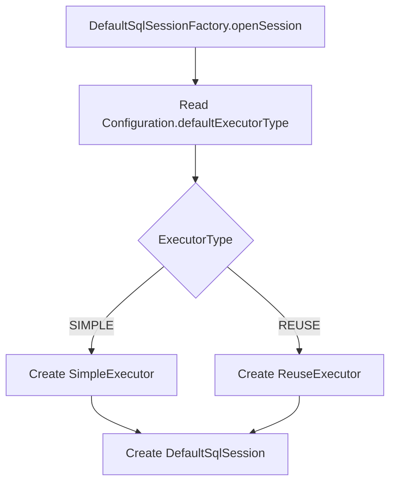
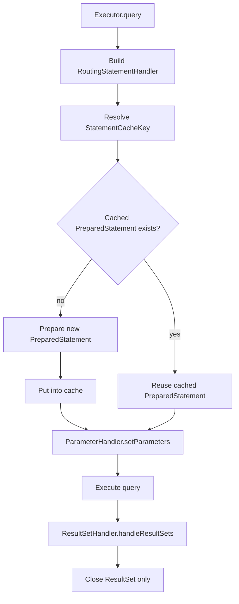
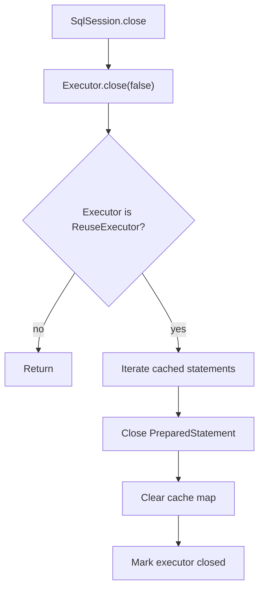

# MyBatis Phase 3: Executor Extension And Statement Reuse

## 1. 目标与范围（必须/不做）

### 必须
- 在不修改 `SqlSession`、`MapperProxy` 对外调用方式的前提下，引入执行器扩展能力。
- 在 `Executor` 体系中增加 `ReuseExecutor`，支持同一 `SqlSession` 内重复 SQL 的 `PreparedStatement` 复用。
- 引入 `RoutingStatementHandler`，为 `StatementHandler` 路由预留稳定扩展点。
- 在 `Configuration` 中增加执行器类型配置，允许 `SIMPLE` 与 `REUSE` 两种策略切换。
- 保持 Phase 1、Phase 2 的 XML 映射模型、参数绑定模型、结果映射模型不变。
- 增加 Statement 缓存关闭策略，确保正常路径和异常路径都释放缓存语句。

### 不做
- 完整动态 SQL
- `${}` 文本替换
- 一级缓存和二级缓存
- 插件体系
- 批处理执行器
- 事务管理
- mini-spring 集成逻辑
- `MappedStatement` 基础字段模型变更

## 2. 设计与关键决策

### 包结构
```text
com.xujn.minimybatis
├── executor
│   ├── Executor
│   ├── SimpleExecutor
│   ├── ReuseExecutor
│   ├── ExecutorType
│   ├── statement
│   │   ├── StatementHandler
│   │   ├── PreparedStatementHandler
│   │   └── RoutingStatementHandler
│   └── support
│       └── StatementCacheKey
├── session
│   ├── Configuration
│   ├── SqlSession
│   ├── SqlSessionFactory
│   └── defaults
│       ├── DefaultSqlSession
│       └── DefaultSqlSessionFactory
├── mapping
│   └── MappedStatement
└── support
    ├── ErrorContext
    ├── ExceptionFactory
    └── JdbcUtils
```

### 核心组件接口草图

#### `ExecutorType`
- 目的：把执行器选择从硬编码切换为配置驱动。
- 最小实现要点：提供 `SIMPLE`、`REUSE` 两种枚举值。
- 边界：Phase 3 不引入 `BATCH`、`CACHING`。
- 可选增强：后续增加装饰器型执行器组合。
- 依赖关系：`executor -> session`

```java
public enum ExecutorType {
    SIMPLE,
    REUSE
}
```

#### `ReuseExecutor`
- 目的：在单个 `SqlSession` 生命周期内复用相同 SQL 的 `PreparedStatement`。
- 最小实现要点：在单会话持有单连接的前提下，以可执行 SQL 文本作为缓存键；在会话关闭时统一关闭缓存语句。
- 边界：只在同一 `SqlSession` 内复用；不跨会话、不跨连接复用。
- 可选增强：后续增加 LRU 控制和统计信息。
- 依赖关系：`executor -> statement / parameter / resultset / session`

```java
public final class ReuseExecutor implements Executor {
    public <E> List<E> query(MappedStatement ms, Object parameter);
    public void close(boolean forceRollback);
}
```

#### `RoutingStatementHandler`
- 目的：把 `StatementHandler` 的具体实现选择收敛到一个稳定入口。
- 最小实现要点：Phase 3 仍只路由到 `PreparedStatementHandler`，但统一由路由类创建和返回。
- 边界：不新增 `CallableStatement`、`Statement`。
- 可选增强：后续扩展为按语句类型或脚本类型路由。
- 依赖关系：`executor.statement -> executor / mapping`

```java
public final class RoutingStatementHandler implements StatementHandler {
    public PreparedStatement prepare(Connection connection);
    public void parameterize(PreparedStatement statement);
    public <E> List<E> query(PreparedStatement statement);
    public BoundSql getBoundSql();
}
```

#### `Configuration`
- 目的：统一持有默认执行器类型。
- 最小实现要点：增加 `ExecutorType defaultExecutorType` 字段和读写方法。
- 边界：只决定会话默认执行器，不做运行期热切换。
- 可选增强：按 statement 级别选择执行器。
- 依赖关系：`session -> executor`

```java
public class Configuration {
    private DataSource dataSource;
    private Map<String, MappedStatement> mappedStatements;
    private MapperRegistry mapperRegistry;
    private ExecutorType defaultExecutorType;
}
```

### 生命周期对齐点
- `DefaultSqlSessionFactory.openSession()` 根据 `Configuration.defaultExecutorType` 创建 `SimpleExecutor` 或 `ReuseExecutor`。
- `ReuseExecutor` 生命周期与 `SqlSession` 对齐，不独立暴露给业务层。
- `ReuseExecutor.close()` 必须先关闭缓存 `PreparedStatement`，再结束执行器生命周期。

### 冲突/错误策略
> [注释] Phase 3 的执行器扩展必须保持入口稳定，扩展点放在 Executor 内部而不是 Session 外层
> - 背景：Phase 1 和 Phase 2 已经稳定了 `SqlSession -> MapperProxy -> Executor` 主调用模型。
> - 影响：新增执行器只能改变语句获取和关闭策略，不能改变 Mapper 方法签名或 `SqlSession` API。
> - 取舍：选择增加 `ReuseExecutor` 和 `ExecutorType`，不新增独立模板层。
> - 可选增强：后续以装饰器方式叠加缓存执行器和统计执行器。

> [注释] Statement 复用只以“同一会话、同一连接、同一 SQL”作为边界
> - 背景：`PreparedStatement` 绑定了连接上下文，跨连接复用会直接破坏 JDBC 语义。
> - 影响：当前实现通过“单会话持有单连接”约束连接边界，因此缓存键只需要看可执行 SQL 文本，不需要额外暴露连接标识。
> - 取舍：Phase 3 只做单会话内复用，不做跨会话共享，也不引入跨连接缓存键模型。
> - 可选增强：未来在事务上下文稳定后再评估线程绑定连接下的复用策略。

> [注释] Statement 复用引入缓存后，资源释放必须从“单次查询关闭”改为“会话关闭统一关闭”
> - 背景：`SimpleExecutor` 每次查询后立即关闭语句，而 `ReuseExecutor` 需要保留语句到当前会话结束。
> - 影响：必须把 `PreparedStatement` 的关闭责任从查询路径迁移到 `ReuseExecutor.close()`。
> - 取舍：继续让 `ResultSet` 在每次查询后立即关闭，但缓存 `PreparedStatement` 到会话结束。
> - 可选增强：当前实现已经在语句执行失败后主动移除坏语句，后续可继续增加失效原因分类和统计信息。

### 失败策略
- SQL 准备失败
  - 目的：及时暴露 JDBC 预编译错误。
  - 最小实现要点：错误信息包含 `statementId`、SQL、执行器类型。
  - 边界：不做重试。
  - 可选增强：增加 SQLState 诊断。
  - 依赖关系：`executor -> jdbc / support`
- 语句缓存命中但已关闭
  - 目的：防止复用失效语句导致隐式错误。
  - 最小实现要点：检测已关闭语句时移除缓存并重新创建。
  - 边界：只处理当前缓存项。
  - 可选增强：增加缓存健康检查统计。
  - 依赖关系：`executor -> statement cache`
- 语句执行失败后缓存淘汰
  - 目的：避免失败过的 `PreparedStatement` 在同一会话内被继续复用。
  - 最小实现要点：`parameterize()` 或 `query()` 抛出运行时异常后，淘汰并关闭对应缓存语句；下次查询重新创建。
  - 边界：只淘汰当前 SQL 对应缓存项。
  - 可选增强：根据异常类型区分“直接淘汰”和“保留重试”。
  - 依赖关系：`executor -> statement cache / support`
- 会话关闭失败
  - 目的：保证尽可能关闭所有缓存语句。
- 最小实现要点：逐个关闭全部缓存语句，最终抛出首个关闭异常，并保留对应语句上下文。
- 边界：不做聚合异常模型，不额外暴露关闭失败列表。
  - 可选增强：增加关闭失败列表。
  - 依赖关系：`executor -> support`

## 3. 流程与图

### 图 1：执行器选择流程
**标题：Phase 3 执行器选择流程**  
**覆盖范围说明：展示 `SqlSessionFactory` 如何根据配置创建不同执行器实现。**



### 图 2：ReuseExecutor 查询与复用流程
**标题：ReuseExecutor Statement 复用流程**  
**覆盖范围说明：展示单会话内 Statement 创建、命中缓存、绑定参数和结果映射的完整链路。**



### 图 3：会话关闭与 Statement 清理流程
**标题：ReuseExecutor 关闭与缓存清理流程**  
**覆盖范围说明：展示 `SqlSession.close()` 触发执行器关闭时的缓存语句释放顺序。**



## 4. 验收标准（可量化）
- `Configuration.defaultExecutorType = SIMPLE` 时，Phase 1 和 Phase 2 全部测试继续通过。
- `Configuration.defaultExecutorType = REUSE` 时，同一 `SqlSession` 内重复执行相同 SQL，`PreparedStatement` 创建次数为 `1`。
- 同一 `SqlSession` 内执行不同 SQL 时，分别创建独立 `PreparedStatement`。
- 不同 `SqlSession` 之间不共享 `PreparedStatement` 缓存。
- `SqlSession.close()` 后，`ReuseExecutor` 缓存中的全部 `PreparedStatement` 关闭次数等于缓存项数量。
- 查询异常后再次执行相同 SQL，能够淘汰坏语句并重新创建新的 `PreparedStatement`。
- 新增扩展点后，不修改 `MappedStatement` 现有基础字段，不修改 Mapper 接口签名。
- Phase 1、Phase 2 的 examples 保持可运行，且在 `SIMPLE` 模式下输出不变。
- `ReuseExecutor.close()` 关闭失败时，异常消息包含 `statementId`、`resource`、`sql`、`executorType`。

## 5. Git 交付计划
- branch: `feature/mybatis-phase-3-executor-extension`
- PR title: `feat(mybatis): implement phase 3 executor extension with statement reuse`
- commits（>=8 条，Angular 格式 + 文件路径）：
  - `feat(executor): add executor type and reuse executor skeleton` -> `/Users/xjn/Develop/projects/java/mini-mybatis/src/main/java/com/xujn/minimybatis/executor/ExecutorType.java`, `/Users/xjn/Develop/projects/java/mini-mybatis/src/main/java/com/xujn/minimybatis/executor/ReuseExecutor.java`
  - `feat(session): select executor implementation from configuration` -> `/Users/xjn/Develop/projects/java/mini-mybatis/src/main/java/com/xujn/minimybatis/session/Configuration.java`, `/Users/xjn/Develop/projects/java/mini-mybatis/src/main/java/com/xujn/minimybatis/session/defaults/DefaultSqlSessionFactory.java`
  - `feat(statement): add routing statement handler entry` -> `/Users/xjn/Develop/projects/java/mini-mybatis/src/main/java/com/xujn/minimybatis/executor/statement/RoutingStatementHandler.java`, `/Users/xjn/Develop/projects/java/mini-mybatis/src/main/java/com/xujn/minimybatis/executor/statement/PreparedStatementHandler.java`
  - `feat(executor): add statement cache key and reuse lifecycle management` -> `/Users/xjn/Develop/projects/java/mini-mybatis/src/main/java/com/xujn/minimybatis/executor/support/StatementCacheKey.java`, `/Users/xjn/Develop/projects/java/mini-mybatis/src/main/java/com/xujn/minimybatis/executor/ReuseExecutor.java`
  - `fix(executor): recreate invalid cached prepared statement on reuse failure` -> `/Users/xjn/Develop/projects/java/mini-mybatis/src/main/java/com/xujn/minimybatis/executor/ReuseExecutor.java`
  - `test(executor): cover statement reuse in same sql session` -> `/Users/xjn/Develop/projects/java/mini-mybatis/src/test/java/com/xujn/minimybatis/Phase3ReuseExecutorTest.java`
  - `test(resources): add phase 3 mapper resources for reuse scenarios` -> `/Users/xjn/Develop/projects/java/mini-mybatis/src/test/resources/mapper/phase3-reuse-mapper.xml`, `/Users/xjn/Develop/projects/java/mini-mybatis/src/main/resources/schema.sql`
  - `feat(examples): add phase 3 reuse executor example` -> `/Users/xjn/Develop/projects/java/mini-mybatis/examples/phase3/com/xujn/minimybatis/examples/phase3/Phase3ReuseExecutorExample.java`
  - `docs(readme): document current phase coverage and verification commands` -> `/Users/xjn/Develop/projects/java/mini-mybatis/README.md`
  - `docs(mybatis): add phase 3 executor extension design and acceptance docs` -> `/Users/xjn/Develop/projects/java/mini-mybatis/docs/mybatis-phase-3.md`, `/Users/xjn/Develop/projects/java/mini-mybatis/tests/acceptance-mybatis-phase-3.md`
